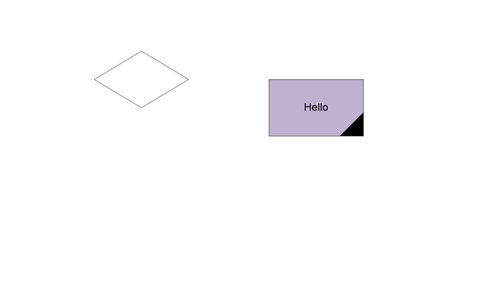

<html dir="LTR" xmlns:mshelp="http://msdn.microsoft.com/mshelp" xmlns:ddue="http://ddue.schemas.microsoft.com/authoring/2003/5" xmlns:xlink="http://www.w3.org/1999/xlink" xmlns:tool="http://www.microsoft.com/tooltip">
    <head>
        <meta http-equiv="Content-Type" content="text/html; CHARSET=utf-8"></meta>
        <meta name="save" content="history"></meta>
        <title>4.1 Samples Section</title>
        <xml>
            <mshelp:toctitle title="4.1 Samples Section"></mshelp:toctitle>
            <mshelp:rltitle title="[MS-CANARYBLOCK]: Samples Section"></mshelp:rltitle>
            <mshelp:keyword index="A" term="10d18e0b-8931-43ef-9ca2-877096442270"></mshelp:keyword>
            <mshelp:attr name="DCSext.ContentType" value="open specification"></mshelp:attr>
            <mshelp:attr name="AssetID" value="10d18e0b-8931-43ef-9ca2-877096442270"></mshelp:attr>
            <mshelp:attr name="TopicType" value="kbRef"></mshelp:attr>
            <mshelp:attr name="DCSext.Title" value="[MS-CANARYBLOCK]: Samples Section" />
        </xml>
    </head>
    <body>
        

            <h1 class="heading">4.1 Samples Section</h1>
        

        

            

                

                

                    

Here is a set of features that ODOC and GenGKDoc SHOULD
support<a href="f810325e-121a-4d2c-82da-e3f3c10a501b.htm#Appendix_A_1" aria-label="Product behavior note 1">&lt;1&gt;</a>.

Visio

                

            

        

    </body>
</html>