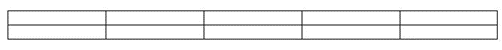

<html dir="LTR" xmlns:mshelp="http://msdn.microsoft.com/mshelp" xmlns:ddue="http://ddue.schemas.microsoft.com/authoring/2003/5" xmlns:xlink="http://www.w3.org/1999/xlink" xmlns:tool="http://www.microsoft.com/tooltip">
 <body>
 

 <h1 class="heading">4.4.10 Office 14 - 523019</h1>
 

 

 

 

 

 

From MS-IPFF (jigarme)

A <a href="f6104033-4e55-48ec-9da1-1b5b736b4dec.md#gt_07bd946b-cc1f-4b1c-8dad-855d7a5f26cd">form
view</a> is a specific visualization of a <a href="f6104033-4e55-48ec-9da1-1b5b736b4dec.md#gt_b320841e-18ad-4661-9a11-7bd8afacd45c">form file</a> in a Web browser.
It specifies what <a href="f6104033-4e55-48ec-9da1-1b5b736b4dec.md#gt_3c89d16f-a826-4166-96ab-bf13e65b1a40">controls</a>
are used to represent the fields in the <a href="f6104033-4e55-48ec-9da1-1b5b736b4dec.md#gt_c7858bfa-d4d2-48a7-ac9c-d2e90fbe3590">form</a> and how they are laid
out. It also provides information to the <a href="f6104033-4e55-48ec-9da1-1b5b736b4dec.md#gt_edb0720e-f343-40c1-80fc-d140823178dc">form server</a> about the
editing behavior for each control: for example, what actions to take when a
particular field’s value changes.

A form view is represented by an <a href="f6104033-4e55-48ec-9da1-1b5b736b4dec.md#gt_e7bdbc86-a7e4-4962-af23-67de95179400">XSL Transformation (XSLT)</a> file,
which uses the .XSL file extension. There are one or more XSLT files in the <a href="f6104033-4e55-48ec-9da1-1b5b736b4dec.md#gt_2024af9c-9fcc-4e6d-b34a-14bfe53b62ca">form template</a>:

<ol><li>
 One default XSLT
file, for example view1.xsl, used to render a form file when it is first opened
or created.

</li><li>
 Other XSLT
files, for example view2.xsl, that can be used to render the form as it is
edited.

</li></ol>
The default XSLT file is specified in the <a href="f6104033-4e55-48ec-9da1-1b5b736b4dec.md#gt_b55e5277-85be-4e84-9b9b-9b2fd48ef4a7">form definition (.xsf) file</a>.

The contents of a XSLT file are used to transform the data
in a form file into HTML, so the form can be rendered and edited in a Web
browser. The resulting HTML visualization consists of HTML used to lay out and
represent the controls and informative text. The HTML for a control will also
contain properties specifying its behavior.

The following table lists the controls that can be used in a
form. Controls are usually tied to specific fields in the form file and are
used to edit such fields. Some controls, as noted in the table, are not the
direct representation of any particular fields.

<table>
 <thead>
 <tr>
 <th>
 
Control

 </th>
 <th>
 
Description
 and sample visual representation

 </th>
 </tr>
 </thead>
 <tr>
 <td>
 
Button

 </td>
 <td>
 
A control
 used to execute an action. It is not tied to a field.

 
 

 
The following
 figure illustrates a typical representation of a button control:

 

 
<b>Figure 1: A button control</b>

 
 

 
The
 visualization and properties of the control are specified in section <a href="a216dd15-2641-4bcb-9f22-a9d5b67a8970.md">4.2.2</a>. The relationship
 to the <a href="f6104033-4e55-48ec-9da1-1b5b736b4dec.md#gt_bd0ce6f9-c350-4900-827e-951265294067">XML schema</a> of
 the form template is specified in section 4.2.2. Behaviors affecting the
 control are specified in sections 4.2.2 and 4.2.2.

 </td>
 </tr>
 <tr>
 <td>
 
Check Box

 </td>
 <td>
 
A control
 that allows users to set yes/no or true/false values by adding or removing a
 check mark from a small square box.

 
 

 
The following
 figure illustrates a typical representation of a check box control:

 

 
<b>Figure 2: A set of check
 box controls</b>

 
 

 
The
 visualization and properties of the control are specified in section 4.2.2.
 The relationship to the XML schema of the form template is specified in
 section 4.2.2. Behaviors affecting the control are specified in sections
 4.2.2 and 4.2.2.

 </td>
 </tr>
 <tr>
 <td>
 
Contact
 Selector

 </td>
 <td>
 
A control
 that allows users to select one or more contacts from a SharePoint user list.

 
 

 
The following
 figure illustrates a typical representation of a contact selector control:

 

 
<b>Figure 3: A contact
 selector control</b>

 
 

 
The
 visualization and properties of the control are specified in section 4.2.2.
 The relationship to the XML schema of the form template is specified in
 section 4.2.2. Behaviors affecting the control are specified in sections
 4.2.2 and 4.2.2.

 </td>
 </tr>
 <tr>
 <td>
 
Date Picker

 </td>
 <td>
 
A control
 that contains a box where users can type dates and a calendar button that
 allows users to select a date. 

 
 

 
The following
 figure illustrates a typical representation of a date picker control:

 

 
<b>Figure 4: A date picker
 control</b>

 
 

 
The
 visualization and properties of the control are specified in section 4.2.2.
 The relationship to the XML schema of the form template is specified in
 section 4.2.2. Behaviors affecting the control are specified in sections
 4.2.2 and 4.2.2.

 </td>
 </tr>
 <tr>
 <td>
 
Drop-Down
 List Box

 </td>
 <td>
 
A control
 that presents users with a list of choices in a box. To select an item from
 the list, users click an arrow to open the list of choices.

 
 

 
The following
 figure illustrates a typical representation of a drop-down list box control:

 

 
<b>Figure 5: A drop-down list
 box control</b>

 
 

 
The
 visualization and properties of the control are specified in section 4.2.2.
 The relationship to the XML schema of the form template is specified in
 section 4.2.2. Behaviors affecting the control are specified in sections
 4.2.2 and 4.2.2.

 </td>
 </tr>
 <tr>
 <td>
 
Expression
 Box

 </td>
 <td>
 
A read-only
 text control used to display information.

 
 

 
The following
 figure illustrates a typical representation of an expression box control:

 

 
<b>Figure 6: An expression
 box control</b>

 
 

 
The
 visualization and properties of the control are specified in section 4.2.2.
 The relationship to the XML schema of the form template is specified in
 section 4.2.2. Behaviors affecting the control are specified in sections
 4.2.2 and 4.2.2.

 </td>
 </tr>
 <tr>
 <td>
 
File
 Attachment

 </td>
 <td>
 
A control
 that allows users to attach files to their form files. Each file attachment
 control permits one file to be attached.

 
 

 
The following
 figure illustrates a typical representation of a file attachment control:

 

 
<b>Figure 7: A file
 attachment control</b>

 
 

 
The
 visualization and properties of the control are specified in section 4.2.2.
 The relationship to the XML schema of the form template is specified in
 section 4.2.2. Behaviors affecting the control are specified in sections
 4.2.2 and 4.2.2.

 </td>
 </tr>
 <tr>
 <td>
 
Hyperlink

 </td>
 <td>
 
A control
 that can be used to link to a <a href="f6104033-4e55-48ec-9da1-1b5b736b4dec.md#gt_433a4fb7-ef84-46b0-ab65-905f5e3a80b1">Uniform Resource Locator
 (URL)</a>.

 
 

 
The following
 figure illustrates a typical representation of a hyperlink:

 

 
<b>Figure 8: A hyperlink control</b>

 
 

 
The
 visualization and properties of the control are specified in section 4.2.2.
 The relationship to the XML schema of the form template is specified in
 section 4.2.2. Behaviors affecting the control are specified in sections
 4.2.2 and 4.2.2.

 </td>
 </tr>
 <tr>
 <td>
 
List Box

 </td>
 <td>
 
A control
 that presents users with a list of choices in a box from which users select
 the appropriate item.

 
 

 
The following
 figure illustrates a typical representation of a list box control:

 

 
<b>Figure 9: A list box
 control</b>

 
 

 
The visualization
 and properties of the control are specified in section 4.2.2. The
 relationship to the XML schema of the form template is specified in section
 4.2.2. Behaviors affecting the control are specified in sections 4.2.2 and
 4.2.2.

 </td>
 </tr>
 <tr>
 <td>
 
Option Button

 </td>
 <td>
 
A control
 that lets users select from a set of mutually exclusive choices. When one
 option button in a group is selected, the other option buttons are cleared.

 
 

 
The following
 figure illustrates a typical representation of an option button control:

 

 
<b>Figure 10: A set of option
 button controls</b>

 
                   

 
The
 visualization and properties of the control are specified in section 4.2.2.
 The relationship to the XML schema of the form template is specified in
 section 4.2.2. Behaviors affecting the control are specified in sections
 4.2.2 and 4.2.2.

 </td>
 </tr>
 <tr>
 <td>
 
Rich Text Box

 </td>
 <td>
 
A text input
 control that can contain formatted text, including bold and italic text, and
 a variety of fonts, font sizes, and font colors.

 
 

 
The following
 figure illustrates a typical representation of a rich text box control:

 

 
<b>Figure 11: A rich text box
 control, the top image shows it in the editing state</b>

 
 

 
The
 visualization and properties of the control are specified in section 4.2.2.
 The relationship to the XML schema of the form template is specified in
 section 4.2.2. Behaviors affecting the control are specified in section 4.2.2
 and 4.2.2.

 </td>
 </tr>
 <tr>
 <td>
 
Table

 </td>
 <td>
 
A table used
 to lay out the form. It is not tied to a field.

 
 

 
The following
 figure illustrates a typical representation of a table control:

 

 
<b>Figure 12: A table</b>

 
 

 
The
 visualization and properties of the control are specified in section 4.2.2.
 The relationship to the XML schema of the form template is specified in
 section 4.2.2. Behaviors affecting the control are specified in sections
 4.2.2 and 4.2.2.

 </td>
 </tr>
 <tr>
 <td>
 
Text Box

 </td>
 <td>
 
A text input
 control that can contain any unformatted text. Text box controls cannot
 contain formatted text.

 
 

 
The following
 figure illustrates a typical representation of a text box control:

 

 
<b>Figure 13: A text box
 control</b>

 
 

 
The
 visualization and properties of the control are specified in section 4.2.2.
 The relationship to the XML schema of the form template is specified in
 section 4.2.2. Behaviors affecting the control are specified in sections
 4.2.2 and 4.2.2.

 </td>
 </tr>
 <tr>
 <td>
 
Repeating
 Table

 </td>
 <td>
 
A control
 that displays repeating information in a tabular structure. Each item appears
 in a new row in the repeating table control. When filling out a form, users
 can add or delete rows in a repeating table control as necessary. Repeating
 table controls can contain other controls.

 
 

 
The following
 figure illustrates a typical representation of a repeating table control:

 

 
<b>Figure 14: A repeating
 section control with three text box controls per row</b>

 
The
 visualization and properties of the control are specified in section 4.2.2.
 The relationship to the XML schema of the form template is specified in
 section 4.2.2. Behaviors affecting the control are specified in sections
 4.2.2 and 4.2.2.

 </td>
 </tr>
 <tr>
 <td>
 
Section,
 Optional Section

 </td>
 <td>
 
A control
 that is a container for other controls. An optional section control is the
 same, but does not need to be initially displayed in the form.

 
 

 
The following
 figure illustrates a typical representation of a section control:

 

 
<b>Figure 15: A section
 control containing two text box controls</b>

 
The
 visualization and properties of the control are specified in section 4.2.2.
 The relationship to the XML schema of the form template is specified in
 section 4.2.2. Behaviors affecting the control are specified in sections
 4.2.2 and 4.2.2.

 </td>
 </tr>
 <tr>
 <td>
 
Repeating
 Section

 </td>
 <td>
 
A control
 that is a container for other controls and is used to display repeating
 information. When filling out the form that includes a repeating section
 control, users can add additional occurrences of the repeating section
 control.

 
 

 
The following
 figure illustrates a typical representation of a repeating section control:

 

 
<b>Figure 17: A repeating
 section control</b>

 
 

 
The visualization and properties of the control are specified in
 section 4.2.2. The relationship to the XML schema of the form template is
 specified in section 4.2.2. Behaviors affecting the control are specified in
 sections 4.2.2 and 4.2.2.

 </td>
 </tr>
</table>

The structure of an XSLT file that defines a form view is
specified in section 4.2.2. The role of each XSLT file is specified in section
4.2.2. Examples are provided in section 4.2.2

 

 

 

 </body>
</html>