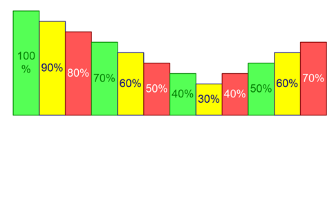

<html dir="LTR" xmlns:mshelp="http://msdn.microsoft.com/mshelp" xmlns:ddue="http://ddue.schemas.microsoft.com/authoring/2003/5" xmlns:xlink="http://www.w3.org/1999/xlink" xmlns:tool="http://www.microsoft.com/tooltip">
    <head>
        <meta http-equiv="Content-Type" content="text/html; CHARSET=utf-8"></meta>
        <meta name="save" content="history"></meta>
        <title>1 Introduction</title>
        <xml>
            <mshelp:toctitle title="1 Introduction"></mshelp:toctitle>
            <mshelp:rltitle title="[MS-CANARYBLOCK]: Introduction"></mshelp:rltitle>
            <mshelp:keyword index="A" term="3d526c0c-b374-498e-973c-1794ee41a987"></mshelp:keyword>
            <mshelp:attr name="DCSext.ContentType" value="open specification"></mshelp:attr>
            <mshelp:attr name="AssetID" value="3d526c0c-b374-498e-973c-1794ee41a987"></mshelp:attr>
            <mshelp:attr name="TopicType" value="kbRef"></mshelp:attr>
            <mshelp:attr name="DCSext.Title" value="[MS-CANARYBLOCK]: Introduction" />
        </xml>
    </head>
    <body>
        

            <h1 class="heading">1 Introduction</h1>
        

        

            

                

                

                    

Visio object. More changes to the Visio Object table test. 
This object allows diagramming. This is using Visio App.

Sections 1.5, 1.8, 1.9, 2, and 3 of this specification are
normative. All other sections and examples in this specification are
informative.

                

            

        

    </body>
</html>