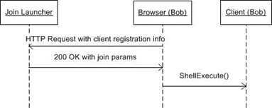

<html dir="LTR" xmlns:mshelp="http://msdn.microsoft.com/mshelp" xmlns:ddue="http://ddue.schemas.microsoft.com/authoring/2003/5" xmlns:xlink="http://www.w3.org/1999/xlink" xmlns:tool="http://www.microsoft.com/tooltip">
    <head>
        <meta http-equiv="Content-Type" content="text/html; CHARSET=utf-8"></meta>
        <meta name="save" content="history"></meta>
        <title>4.4.19 Content lost Caption</title>
        <xml>
            <mshelp:toctitle title="4.4.19 Content lost Caption"></mshelp:toctitle>
            <mshelp:rltitle title="[MS-CANARYBLOCK]: Content lost Caption"></mshelp:rltitle>
            <mshelp:keyword index="A" term="49f6dc48-1c91-4908-8fb2-2606d19b055a"></mshelp:keyword>
            <mshelp:attr name="DCSext.ContentType" value="open specification"></mshelp:attr>
            <mshelp:attr name="AssetID" value="49f6dc48-1c91-4908-8fb2-2606d19b055a"></mshelp:attr>
            <mshelp:attr name="TopicType" value="kbRef"></mshelp:attr>
            <mshelp:attr name="DCSext.Title" value="[MS-CANARYBLOCK]: Content lost Caption" />
        </xml>
    </head>
    <body>
        

            <h1 class="heading">4.4.19 Content lost Caption</h1>
        

        

            

                

                

                    

A standard call flow sequence is shown in the following
figure. The sequence shown is based on the protocol sequence described in
section <a href="bc26357f-e904-4d7c-8b02-5a28e4ed3104.htm">2.1</a>.

<b>Figure 11: Standard call flow sequence</b>

<b>When user Bob initiates a Simple Join by clicking on the
conferencing join web URL, Bob’s browser (in this case, Internet Explorer)
sends an HTTP request to Join Launcher as shown in the following example.</b>

<dl>
<dd>

<pre>  
 GET /meet/bob/MJMVY7RF HTTP/1.1
 Accept: image/gif, image/jpeg, image/pjpeg, application/x-ms-application, application/vnd.ms-xpsdocument, application/xaml+xml, application/x-ms-xbap, application/vnd.ms-excel, application/vnd.ms-powerpoint, application/msword, application/x-shockwave-flash, application/Vnd.Microsoft.OCSMeeting, */*
 Accept-Language: en-us
 User-Agent: Mozilla/4.0 (compatible; MSIE 8.0; Windows NT 6.0; Trident/4.0; GTB6; MS-OC 4.0; CWADS32; SLCC1; .NET CLR 2.0.50727; Tablet PC 2.0; .NET CLR 1.1.4322; InfoPath.2; .NET CLR 3.5.21022; MS-RTC LM 8; .NET CLR 3.5.30729; .NET CLR 3.0.30618)
 Accept-Encoding: gzip, deflate
 Host: www.fabrikam.com
 Connection: Keep-Alive
 Cookie: MC1=GUID=a0e6a97cda7641a496b14ca0665f35a7&amp;HASH=a0e6&amp;LV=20099&amp;V=3; WT_FPC=id=131.107.0.106-1797821888.30059372:lv=1265936990571:ss=1265936990571
  
</pre>

</dd></dl>

Join Launcher parses the conferencing join web URL, detects
the presence of the client on Bob’s machine and sends an HTTP response to Bob’s
browser as shown in the following example.

<dl>
<dd>

<pre> HTTP/1.1 200 OK
 Cache-Control: private
 Content-Type: application/vnd.microsoft.ocsmeeting; charset=utf-8
 Server: Microsoft-IIS/7.0
 Content-Disposition: inline
 X-AspNet-Version: 2.0.50727
 X-Powered-By: ASP.NET
 Date: Fri, 12 Feb 2010 02:58:20 GMT
 Content-Length: 499
  
 &#65279;&lt;?xml version=&quot;1.0&quot; encoding=&quot;utf-8&quot;?&gt;
 &lt;conf-info xmlns:xsi=&quot;http://www.w3.org/2001/XMLSchema-instance&quot; xmlns:xsd=&quot;http://www.w3.org/2001/XMLSchema&quot; xmlns=&quot;http://schemas.microsoft.com/rtc/2009/05/simplejoinconfdoc&quot;&gt;
   &lt;conf-uri&gt;sip:bob@fabrikam.com;gruu;opaque=app:conf:focus:id:MJMVY7RF&lt;/conf-uri&gt;
   &lt;server-time&gt;1.0001&lt;/server-time&gt;
   &lt;original-incoming-url&gt;https://www.fabrikam.com/meet/bob/MJMVY7RF&lt;/original-incoming-url&gt;
   &lt;conf-key&gt;MJMVY7RF&lt;/conf-key&gt;
 &lt;/conf-info&gt;
  
</pre>

</dd></dl>

Bob’s browser receives the response and calls ShellExecute()
to launch the client on Bob’s machine, passing it the contents of the content
body from the response.

                

            

        

    </body>
</html>