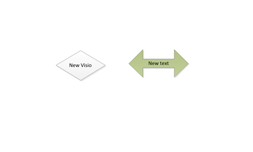

<html dir="LTR" xmlns:mshelp="http://msdn.microsoft.com/mshelp" xmlns:ddue="http://ddue.schemas.microsoft.com/authoring/2003/5" xmlns:xlink="http://www.w3.org/1999/xlink" xmlns:tool="http://www.microsoft.com/tooltip">
    <head>
        <meta http-equiv="Content-Type" content="text/html; CHARSET=utf-8"></meta>
        <meta name="save" content="history"></meta>
        <title>1.8 Vendor-Extensible Fields</title>
        <xml>
            <mshelp:toctitle title="1.8 Vendor-Extensible Fields"></mshelp:toctitle>
            <mshelp:rltitle title="[MS-CANARYBLOCK]: Vendor-Extensible Fields"></mshelp:rltitle>
            <mshelp:keyword index="A" term="50d1f7f8-a53c-4696-bfd5-ed99a82d6529"></mshelp:keyword>
            <mshelp:attr name="DCSext.ContentType" value="open specification"></mshelp:attr>
            <mshelp:attr name="AssetID" value="50d1f7f8-a53c-4696-bfd5-ed99a82d6529"></mshelp:attr>
            <mshelp:attr name="TopicType" value="kbRef"></mshelp:attr>
            <mshelp:attr name="DCSext.Title" value="[MS-CANARYBLOCK]: Vendor-Extensible Fields" />
        </xml>
    </head>
    <body>
        

            <h1 class="heading">1.8 Vendor-Extensible Fields</h1>
        

        

            

                

                

                    

Visio object – Added content

<b>Figure 1: Visio Object above</b>

<b>Figure 2 : New Visio above</b>

<b>Figure 5: Copy and paste no change </b>

<b>Figure 6: Copy via Drag and Drop</b>

NEW OBject

Drag and drop package

Copy and Paste

Copy and paste edit

                

            

        

    </body>
</html>