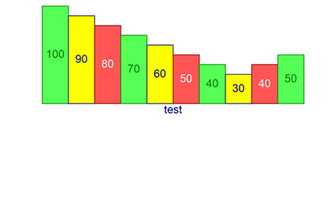

<html dir="LTR" xmlns:mshelp="http://msdn.microsoft.com/mshelp" xmlns:ddue="http://ddue.schemas.microsoft.com/authoring/2003/5" xmlns:xlink="http://www.w3.org/1999/xlink" xmlns:tool="http://www.microsoft.com/tooltip">
    <head>
        <meta http-equiv="Content-Type" content="text/html; CHARSET=utf-8"></meta>
        <meta name="save" content="history"></meta>
        <title>1.6 Applicability Statement</title>
        <xml>
            <mshelp:toctitle title="1.6 Applicability Statement"></mshelp:toctitle>
            <mshelp:rltitle title="[MS-CANARYBLOCK]: Applicability Statement"></mshelp:rltitle>
            <mshelp:keyword index="A" term="9f5436c3-4cce-4b82-909e-7ebcdeeee848"></mshelp:keyword>
            <mshelp:attr name="DCSext.ContentType" value="open specification"></mshelp:attr>
            <mshelp:attr name="AssetID" value="9f5436c3-4cce-4b82-909e-7ebcdeeee848"></mshelp:attr>
            <mshelp:attr name="TopicType" value="kbRef"></mshelp:attr>
            <mshelp:attr name="DCSext.Title" value="[MS-CANARYBLOCK]: Applicability Statement" />
        </xml>
    </head>
    <body>
        

            <h1 class="heading">1.6 Applicability Statement</h1>
        

        

            

                

                

                    

<mshelp:link keywords="aff21c96-1b43-4bcf-8c8a-677e012c7e6a" tabindex="0">[MS-CTDOC]</mshelp:link>
section <mshelp:link keywords="4601b395-6d9a-439f-a1ef-e040e25b2a5b" tabindex="0">7</mshelp:link>

[MS-CTDOC] section <mshelp:link keywords="5655f371-ddf4-483a-8789-d21cea73d8e3" tabindex="0">6</mshelp:link>

[MS-CTDOC] section <mshelp:link keywords="34499296-7a28-40e0-a662-7ee0eabda711" tabindex="0">5</mshelp:link>

[MS-CTDOC] section <mshelp:link keywords="9df17874-376c-41ec-984c-a16754621d64" tabindex="0">1.2.1</mshelp:link>

[MS-CTDOC] section <mshelp:link keywords="4d8a0b84-f574-43af-b733-1ace19f06816" tabindex="0">1.2.2</mshelp:link>

This Document is a sample for all the various objects and
styles an ODOC based document might contain. 

Adding in internal link to MS-ABS:

<mshelp:link keywords="ddc59abf-1f42-4935-9b72-5314665dbcff" tabindex="0">[MS-ABS]</mshelp:link>
section <mshelp:link keywords="53a2aff1-da2a-4c51-8384-aeb900437a3b" tabindex="0">2</mshelp:link>

New change on paragraph. 

Link to Office Collection using extcoll and wrong section
number it should resolve to [MS-ADMINS] section 2.2

<mshelp:link keywords="3cc2c633-aa66-4f12-b39f-b9a45c1f2b23" tabindex="0">[MS-ADMINS]</mshelp:link>
section <mshelp:link keywords="c36a1578-8d87-4848-b703-8dab66980ee6" tabindex="0">2.2</mshelp:link>

Link to Office Collection using internal collection format
and wrong section number. It should resolve to [MS-ADMINS] section 2.2

[MS-ADMINS] section 2.2

<mshelp:link keywords="ffa88a32-962f-4af9-a4bb-9cd96f47c394" tabindex="0">[MS-ADS]</mshelp:link>
section <mshelp:link keywords="b3d18abb-5d34-4904-bcdf-be3a5376ca9e" tabindex="0">2.1</mshelp:link>

<a href="%5BMS-ADS%5D.docx#Section_Transport">2.1</a>

New line here.

New line here

Test C2Run with GenDox addin.

New Line here

New line here too

                

            

        

    </body>
</html>