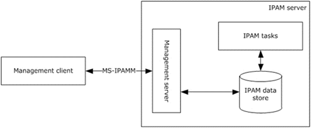

<html dir="LTR" xmlns:mshelp="http://msdn.microsoft.com/mshelp" xmlns:ddue="http://ddue.schemas.microsoft.com/authoring/2003/5" xmlns:xlink="http://www.w3.org/1999/xlink" xmlns:tool="http://www.microsoft.com/tooltip">
 <body>
 

 <h1 class="heading">1.3 Overview</h1>
 

 

 

 

 

 

This protocol consists of both management client and the <a href="21b4a631-8f28-420f-822f-c5f879d5046e.md#gt_acc6da41-9eaa-4f40-8968-1b208f66e1c1">management server</a> roles. 
They form the end-points of the protocol. The management client performs remote
management of the data in the <a href="21b4a631-8f28-420f-822f-c5f879d5046e.md#gt_1ebbf4e0-d234-4732-a83d-022081131cea">IPAM
data store</a> by communicating with the management server using this protocol.
The management server performs the management operations against the data in
the IPAM data store on behalf of the management client. As indicated in the
following illustration, IPAM tasks interact with the <a href="21b4a631-8f28-420f-822f-c5f879d5046e.md#gt_06dde11c-7929-4f48-a1c7-f48fb71e8341">Dynamic Host Configuration
Protocol (DHCP)</a> and DNS servers in the network to gather information from
the <a href="21b4a631-8f28-420f-822f-c5f879d5046e.md#gt_f710d724-5feb-459f-bb01-4d89154f8508">address space management</a>
in an implementation specific manner and add them to the IPAM data store.

<b>Figure 1: Overview</b>

 

 

 

 </body>
</html>