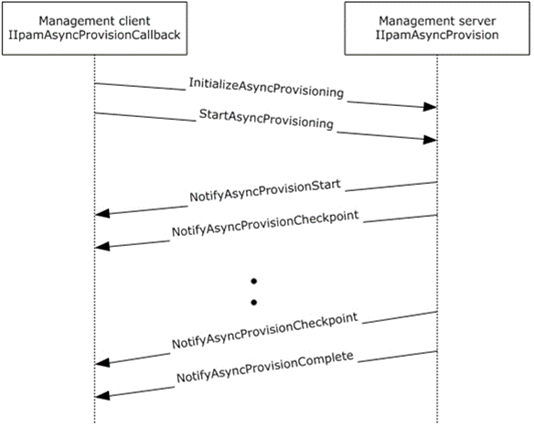

<html dir="LTR" xmlns:mshelp="http://msdn.microsoft.com/mshelp" xmlns:ddue="http://ddue.schemas.microsoft.com/authoring/2003/5" xmlns:xlink="http://www.w3.org/1999/xlink" xmlns:tool="http://www.microsoft.com/tooltip">
 <body>
 

 <h1 class="heading">3.11 IIpamAsyncProvision Server Details</h1>
 

 

 

 

 

 

This port type enables the provisioning of the IPAM data
store, which is required before performing any other management activity. The
provisioning activity can be a time-consuming activity. By taking the callback
approach, it is possible to perform and complete the activity without running
into operation timeouts that are managed by the lower layers. The following
diagram shows the interaction between the management client and the management
server to enable the provisioning scenario.

<b>Figure 6: Provisioning – protocol interaction</b>

 

 

 

 </body>
</html>