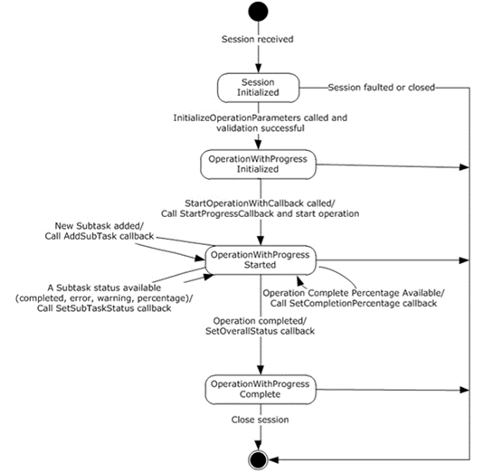

<html dir="LTR" xmlns:mshelp="http://msdn.microsoft.com/mshelp" xmlns:ddue="http://ddue.schemas.microsoft.com/authoring/2003/5" xmlns:xlink="http://www.w3.org/1999/xlink" xmlns:tool="http://www.microsoft.com/tooltip">
 <body>
 

 <h1 class="heading">3.19.1.1 State Machine</h1>
 

 

 

 

 

 

The following figure shows the state machine of the
IIpamOperationWithProgress server port type.

<b>Figure 13: IIpamOperationWithProgress - server state
machine</b>

The IIpamOperationWithProgress server is session-based and
stateful in nature. The session state variable keeps track of the current state
for each session, and can have the following states as possible values. At any
point of the session, if the session is known to be faulted or closed by the
lower layer, the state machine ends.

<table>
 <thead>
 <tr>
 <th>
 
State

 </th>
 <th>
 
Description

 </th>
 </tr>
 </thead>
 <tr>
 <td>
 
Session Initialized

 </td>
 <td>
 
This is the initial state of the session, indicated
 from the lower layer of the protocol.

 
In this state, when the InitializeOperationParameters
 operation is invoked (by the client), the data received as a part of the
 InitializeOperationParameters is validated. 

 
If the data validation succeeds, the state is changed
 to <b>OperationWithProgressInitialized</b> 

 
If the data validation fails, the server returns an
 appropriate <a href="21b4a631-8f28-420f-822f-c5f879d5046e.md#gt_ec8728a8-1a75-426f-8767-aa1932c7c19f">SOAP fault</a>
 and closes the session.

 </td>
 </tr>
 <tr>
 <td>
 
OperationWithProgress Initialized

 </td>
 <td>
 
This is the state when the IpamOperationWithProgress
 is initialized and ready to start the specified operation.

 
In this state, the StartOperationWithCallback
 operation is invoked (by the client), and the server invokes the
 StartProgressCallback and triggers the operation. The state is changed to
 OperationWithProgress Started.

 </td>
 </tr>
 <tr>
 <td>
 
OperationWithProgress Started

 </td>
 <td>
 
Denotes that the operation has been initialized
 successfully and is currently in progress.

 
An operation can be divided into subtasks that can be added
 to the overall operation at any time and be tracked separately. If the
 operation requires a new subtask, the AddSubTask callback operation is
 invoked. The state remains OperationWithProgress Started.

 
As the subtasks progress, the percentage progress will
 change, and the subtask is completed with success, with error, or with
 warning. In each of these cases, the SetSubTaskStatus operation is invoked.
 The state remains OperationWithProgress Started.

 
If the server operation is tracking the overall
 operation percentage completion and if the percentage completion of the
 operation changes, the SetCompletionPercentage operation is invoked. The
 state remains OperationWithProgress Started. 

 
If all the subtasks and the operation as a whole is
 completed with success, with error, or with warnings, the SetOverallStatus
 callback operation is invoked. The state is changed to OperationWithProgress
 Completed.

 </td>
 </tr>
 <tr>
 <td>
 
OperationWithProgress Completed

 </td>
 <td>
 
Indicates that there is no further processing required
 in the session and proceeds to close the session.

 </td>
 </tr>
</table>

 

 

 

 

 </body>
</html>