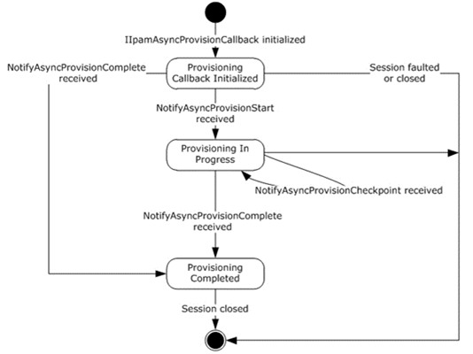

<html dir="LTR" xmlns:mshelp="http://msdn.microsoft.com/mshelp" xmlns:ddue="http://ddue.schemas.microsoft.com/authoring/2003/5" xmlns:xlink="http://www.w3.org/1999/xlink" xmlns:tool="http://www.microsoft.com/tooltip">
 <body>
 

 <h1 class="heading">3.13.1.1 State Machine</h1>
 

 

 

 

 

 

The following figure shows the state machine of the
IIpamAsyncProvisionCallback server port type.

<b>Figure 8: IIpamAsyncProvisionCallback state machine</b>

The IIpamAsyncProvisionCallback server is session-based
sharing the same session the management client has with the management server
using the IIpamAsyncProvision port type. It is also stateful in nature. The <b>session
state</b> variable will be used to keep track of the current state for each
session and it can have the following states as possible values. At any point
of the session, if the session is known to be faulted or closed by the lower
layer, the state machine ends.

<table>
 <thead>
 <tr>
 <th>
 
State

 </th>
 <th>
 
Description

 </th>
 </tr>
 </thead>
 <tr>
 <td>
 
Provisioning Callback Initialized

 </td>
 <td>
 
This is the initial state of the
 IIpamAsyncProvisionCallback will be when it has been initialized by the
 IIpamAsyncProvision client.

 
When the NotifyAsyncProvisionStart is received in this
 state from the IIpamAsyncProvision server port on the management server-end
 of the session, the transition to the <b>Provisioning In Progress</b> state
 will happen.

 </td>
 </tr>
 <tr>
 <td>
 
Provisioning In Progress

 </td>
 <td>
 
This state indicates the IIpamAsyncProvisionCallback
 is ready to receive the provisioning checkpoint and completion status.

 
When the NotifyAsyncProvisionCheckpoint is received in
 this state from the IIpamAsyncProvision server port on the management
 server-end of the session, the state will continue to be in <b>Provisioning
 In Progress</b>. 

 
When the NotifyAsyncProvisionComplete is received in
 this state from the IIpamAsyncProvision server port on the management
 server-end of the session, the state will transition to <b>Provisioning
 Completed</b>.

 </td>
 </tr>
 <tr>
 <td>
 
Provisioning Completed

 </td>
 <td>
 
This is the state to notify the Provisioning
 interaction between the IIpamAsyncProvision server port on the management
 server-end and the IIpamAsyncProvisionCallback server port on the management
 client-end is complete and the result is available.

 </td>
 </tr>
</table>

 

 

 

 

 </body>
</html>