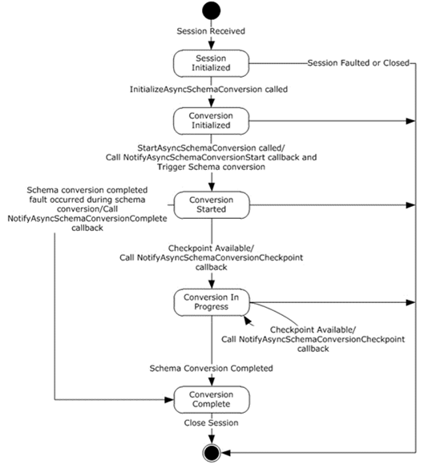

<html dir="LTR" xmlns:mshelp="http://msdn.microsoft.com/mshelp" xmlns:ddue="http://ddue.schemas.microsoft.com/authoring/2003/5" xmlns:xlink="http://www.w3.org/1999/xlink" xmlns:tool="http://www.microsoft.com/tooltip">
 <body>
 

 <h1 class="heading">3.15.1.1 State Machine</h1>
 

 

 

 

 

 

The following figure shows the state machine of the
IIpamEnumerator server port type.

<b>Figure 10: IIpamAsyncSchemaConversion server state machine</b>

The IIpamAsyncSchemaConversion server is session-based and
stateful in nature. The <b>session state</b> variable will be used to keep
track of the current state for each session and it can have the following
states as possible values. At any point of the session, if the session is known
to be faulted or closed by the lower layer, the state machine ends.

<table>
 <thead>
 <tr>
 <th>
 
State

 </th>
 <th>
 
Description

 </th>
 </tr>
 </thead>
 <tr>
 <td>
 
Session Initialized

 </td>
 <td>
 
This would be the initial state of the session when it
 has been indicated from the lower layer of the protocol.

 
In this state, when the
 InitializeAsyncSchemaConversion operation request is received from the
 management client, the state is changed to <b>Provisioning Initialized</b>. 

 </td>
 </tr>
 <tr>
 <td>
 
Conversion Initialized

 </td>
 <td>
 
This would be the state when the schema conversion is
 initialized and ready to start the processing.

 
In this state, when the StartAsyncSchemaConversion
 operation request is received from the management client, the server invokes
 the NotifyAsyncSchemaConversionStart and triggers the schema conversion. The
 state is changed to <b>Conversion Started</b>.

 </td>
 </tr>
 <tr>
 <td>
 
Conversion Started

 </td>
 <td>
 
This state denotes the schema conversion has been
 initialized successfully and is currently in progress.

 
If there is a checkpoint available to be sent across
 to the management client, the NotifyAsyncSchemaConversionCheckpoint operation
 is invoked and the state is changed to <b>Conversion In Progress</b>.

 
When the schema conversion has completed successfully,
 the NotifyAsyncSchemaConversionComplete operation is invoked and the state is
 changed to <b>Conversion Completed</b>. 

 
When the scheme conversion has failed to complete with
 some error, the NotifyAsyncSchemaConversionComplete is called to provide the
 fault information to the client and the state is changed to <b>Conversion
 Completed</b>.

 </td>
 </tr>
 <tr>
 <td>
 
Conversion In Progress

 </td>
 <td>
 
This state denotes the schema conversion is in
 progress.

 
If there is a checkpoint available to be sent across
 to the management client, the NotifyAsyncSchemaConversionCheckpoint operation
 is invoked and the state is changed to <b>Conversion In Progress</b>.

 
When the schema conversion has completed successfully,
 the NotifyAsyncSchemaConversionComplete operation is invoked and the state is
 changed to <b>Conversion Completed</b>. 

 
When the scheme conversion has failed to complete with
 some error, the NotifyAsyncSchemaConversionComplete is called to provide the
 fault information to the client and the state is changed to <b>Conversion
 Completed</b>.

 </td>
 </tr>
 <tr>
 <td>
 
Conversion Completed

 </td>
 <td>
 
This state indicates there is no further processing
 required in the session and proceeds to close the session itself.

 </td>
 </tr>
</table>

 

 

 

 

 </body>
</html>