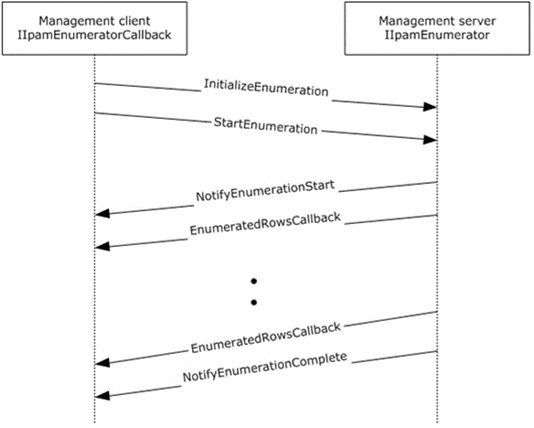

<html dir="LTR" xmlns:mshelp="http://msdn.microsoft.com/mshelp" xmlns:ddue="http://ddue.schemas.microsoft.com/authoring/2003/5" xmlns:xlink="http://www.w3.org/1999/xlink" xmlns:tool="http://www.microsoft.com/tooltip">
 <body>
 

 <h1 class="heading">3.5 IIpamEnumerator Server Details</h1>
 

 

 

 

 

 

This port type is used for enumerating larger number of rows
from the management server. The management client establishes a session to the
management server, invokes operations on the management server port to
initialize the enumeration parameters and trigger the enumeration. On the same
session, the client initializes the IIpamEnumeratorCallback port type server.
This port type provides a callback that the management server can call to
provide the enumeration rows. The interaction is captured in the following
figure.

<b>Figure 3: Enumeration Callback Interaction</b>

 

 

 

 </body>
</html>