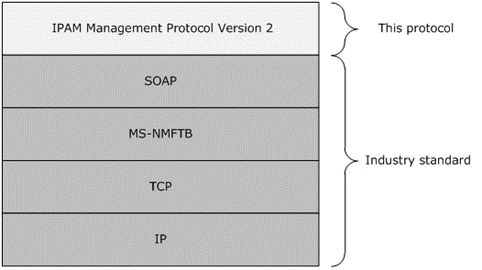

<html dir="LTR" xmlns:mshelp="http://msdn.microsoft.com/mshelp" xmlns:ddue="http://ddue.schemas.microsoft.com/authoring/2003/5" xmlns:xlink="http://www.w3.org/1999/xlink" xmlns:tool="http://www.microsoft.com/tooltip">
 <body>
 

 <h1 class="heading">1.4 Relationship to Other Protocols</h1>
 

 

 

 

 

 

The IPAM Management Protocol uses <a href="21b4a631-8f28-420f-822f-c5f879d5046e.md#gt_96185df3-4677-478c-b239-f72fcf514c59">SOAP message</a> for formatting
requests and responses as specified in <a href="https://go.microsoft.com/fwlink/?LinkId=94664">[SOAP1.2-1/2007]</a> and <a href="https://go.microsoft.com/fwlink/?LinkId=119124">[SOAP1.2-2/2007]</a>.
These SOAP messages are sent over the .NET Message Framing TCP Binding Protocol
(<mshelp:link keywords="946510ad-c6c6-43d5-95ee-c4e982665ee5" tabindex="0">[MS-NMFTB]</mshelp:link>)
which is built on top of TCP/IP protocol. 

The following diagram shows the underlying messaging and
transport stack that is being used by this protocol.

<b>Figure 2: Protocol Stack Diagram</b>

 

 

 

 </body>
</html>