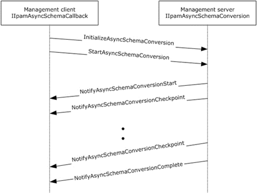

<html dir="LTR" xmlns:mshelp="http://msdn.microsoft.com/mshelp" xmlns:ddue="http://ddue.schemas.microsoft.com/authoring/2003/5" xmlns:xlink="http://www.w3.org/1999/xlink" xmlns:tool="http://www.microsoft.com/tooltip">
 <body>
 

 <h1 class="heading">3.15 IIpamAsyncSchemaConversion Server Details</h1>
 

 

 

 

 

 

This port type enables the <a href="21b4a631-8f28-420f-822f-c5f879d5046e.md#gt_9e010c42-1f32-4691-a335-8164995a9482">schema conversion</a> of the
IPAM data store. When the management server determines the need for schema
conversion, no other management activity can be performed until the schema
conversion is completed. The schema conversion can be time consuming. By taking
the callback approach, it is possible to complete the schema conversion without
running into operation timeouts that are managed by the lower layers. The
following diagram shows the interaction between the management client and the
management server to enable the provisioning scenario.

<b>Figure 9: Schema Conversion - Protocol Interaction</b>

 

 

 

 </body>
</html>