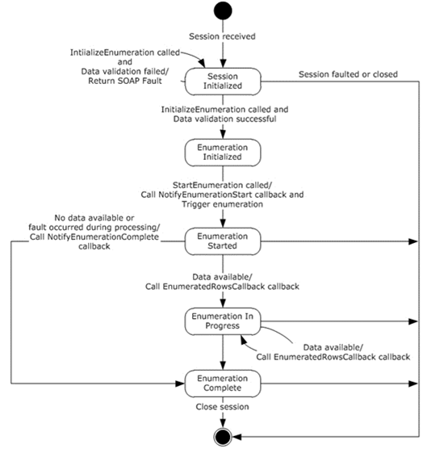

<html dir="LTR" xmlns:mshelp="http://msdn.microsoft.com/mshelp" xmlns:ddue="http://ddue.schemas.microsoft.com/authoring/2003/5" xmlns:xlink="http://www.w3.org/1999/xlink" xmlns:tool="http://www.microsoft.com/tooltip">
 <body>
 

 <h1 class="heading">3.5.1.1 State Machine</h1>
 

 

 

 

 

 

The following figure shows the state machine of the
IIpamEnumerator server port type.

<b>Figure 4: IIpamEnumerator - server state machine</b>

The IIpamEnumerator server is session-based and stateful in
nature. The <b>session state</b> variable will be used to keep track of the
current state for each session and it can have the following states as possible
values. At any point of the session, if the session is known to be faulted or
closed by the lower layer, the state machine ends.

<table>
 <thead>
 <tr>
 <th>
 
State

 </th>
 <th>
 
Description

 </th>
 </tr>
 </thead>
 <tr>
 <td>
 
<b>Session Initialized</b>

 </td>
 <td>
 
This would be the initial state of the session when it
 has been indicated from the lower layer of the protocol.

 
When in this state, when the InitializeEnumeration
 operation is invoked (by the client), the data received as a part of the
 InitializeEnumeration is validated. 

 
If the data validation succeeds, the state is changed
 to <b>Enumeration Initialized</b>. 

 
If the data validation fails, the server returns an
 appropriate <a href="21b4a631-8f28-420f-822f-c5f879d5046e.md#gt_ec8728a8-1a75-426f-8767-aa1932c7c19f">SOAP fault</a>
 and remains in the <b>Session Initialized</b> state itself.

 </td>
 </tr>
 <tr>
 <td>
 
<b>Enumeration Initialized</b>

 </td>
 <td>
 
This would be the state when the enumerator is
 initialized and ready to start the processing to return the data back to the
 client.

 
When in this state, the StartEnumeration operation is
 invoked (by the client), the server invokes the NotifyEnumerationStart and
 triggers the enumeration processing. The state is changed to <b>Enumeration
 Started</b>.

 </td>
 </tr>
 <tr>
 <td>
 
<b>Enumeration Started</b>

 </td>
 <td>
 
This state denotes the enumeration has been
 initialized successfully and the enumeration processing is currently in
 progress.

 
If there is data available to be sent across from the
 enumeration processing, the EnumeratedRowsCallback operation is invoked with
 the data available and the state is changed to <b>Enumeration In Progress</b>.

 
If there is no data available but the enumeration processing
 completes successfully, the NotifyEnumerationComplete operation is invoked
 and the state is changed to <b>Enumeration Completed</b>. 

 
If there is no data available but the enumeration
 processing has failed with some error, the NotifyEnumerationComplete is
 called to provide the fault information to the client and the state is
 changed to <b>Enumeration Completed</b>.

 </td>
 </tr>
 <tr>
 <td>
 
<b>Enumeration In Progress</b>

 </td>
 <td>
 
This state denotes the enumeration is in progress and
 more data is available to be sent across to the client.

 
If there is data available to be sent across from the
 enumeration processing, the EnumeratedRowsCallback operation is invoked with
 the data available and the state remains at <b>Enumeration In Progress.</b>

 
If there is no data available but the enumeration
 processing completes successfully, the NotifyEnumerationComplete operation is
 invoked and the state is changed to <b>Enumeration Completed</b>. 

 
If there is no data available but the enumeration
 processing has failed with some error, the NotifyEnumerationComplete is
 called to provide the fault information to the client and the state is
 changed to <b>Enumeration Completed</b>.

 </td>
 </tr>
 <tr>
 <td>
 
<b>Enumeration Completed</b>

 </td>
 <td>
 
This state indicates there is no further processing
 required in the session and proceeds to close the session itself.

 </td>
 </tr>
</table>

 

 

 

 

 </body>
</html>