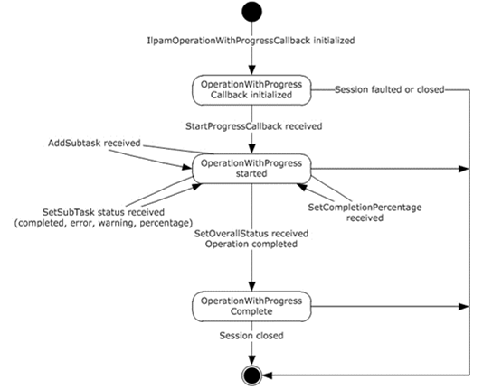

<html dir="LTR" xmlns:mshelp="http://msdn.microsoft.com/mshelp" xmlns:ddue="http://ddue.schemas.microsoft.com/authoring/2003/5" xmlns:xlink="http://www.w3.org/1999/xlink" xmlns:tool="http://www.microsoft.com/tooltip">
 <body>
 

 <h1 class="heading">3.21.1.1 State Machine</h1>
 

 

 

 

 

 

The following figure shows the state machine of the
IIpamOperationWithProgressCallback server port type.

<b>Figure 14: IIpamOperationWithProgressCallback state machine</b>

The IIpamOperationWithProgressCallback server is
session-based, sharing the same session the management client has with the
management server using the IIpamOperationWithProgress port type. It is also
stateful in nature. The session state variable is used to keep track of the
current state for each session and it can have the following states as possible
values. At any point of the session, if the session is known to be faulted or
closed by the lower layer, the state machine ends.

<table>
 <thead>
 <tr>
 <th>
 
State

 </th>
 <th>
 
Description

 </th>
 </tr>
 </thead>
 <tr>
 <td>
 
OperationWithProgress Callback initialized

 </td>
 <td>
 
This is the initial state of the
 IIpamOperationWithProgressCallback when it has been initialized by the
 IIpamOperationWithProgress client.

 
When the StartProgressCallback is received in this
 state from the IIpamOperationWithProgress server port on the management
 server-end of the session, the transition to the OperationWithProgress
 started state will happen.

 </td>
 </tr>
 <tr>
 <td>
 
OperationWithProgress

 
started

 </td>
 <td>
 
This state indicates the
 IIpamOperationWithProgressCallback is ready to receive the task and subtask
 status.

 
When the AddSubTask callback or SetSubTaskStatus
 callback or SetCompletionPercentage callback is received in this state from
 the IIpamOperationWithProgress server port on the management server-end of
 the session, the state will continue to be in OperationWithProgress Started. 

 
When the SetOverallStatus callback is received in this
 state from the IIpamOperationWithProgress server port on the management
 server-end of the session, the state will transition to OperationWithProgress
 Completed.

 </td>
 </tr>
 <tr>
 <td>
 
OperationWithProgress 

 
completed

 </td>
 <td>
 
This is the state to notify that the interaction
 between the IIpamOperationWithProgress server port on the management
 server-end and the IIpamOperationWithProgressCallback server port on the
 management client-end is complete and the overall status of the operation is
 available.

 </td>
 </tr>
</table>

 

 

 

 

 </body>
</html>