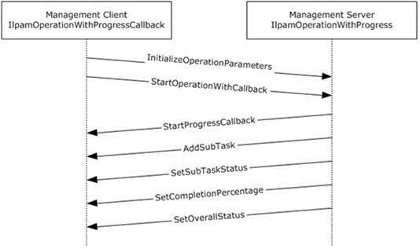

<html dir="LTR" xmlns:mshelp="http://msdn.microsoft.com/mshelp" xmlns:ddue="http://ddue.schemas.microsoft.com/authoring/2003/5" xmlns:xlink="http://www.w3.org/1999/xlink" xmlns:tool="http://www.microsoft.com/tooltip">
 <body>
 

 <h1 class="heading">3.19 IIpamOperationWithProgress Server Details</h1>
 

 

 

 

 

 

This port type is used by the management client to track the
progress of operations running on the management server. The management client
establishes a session by calling the management server port to initialize and
start the operation. The client then initializes the IIpamOperationWithProgressCallback
port type server. This port type enables the management server to call back and
provide the status and percent of completion of the operation. The interaction
is captured in the following diagram.

<ol><li>
 The management
client calls InitializeOperationParameters to initiate the operation. 

</li><li>
 It calls
StartOperationWithCallback to start the operation. 

</li><li>
 The management
server calls StartProgressCallback on the interface
IIpamOperationWithProgressCallback indicating to the management client that the
management server is starting the operation and will send the status and task
messages back. 

</li><li>
 While the
operation is in progress, the management server can indicate that some subtasks
are starting by calling AddSubTask and also set the subtask status or the
overall status by calling the functions SetSubTaskStatus, setOverallStatus, or
SetCompletionPercentage. 

</li><li>
 The operation
ends when the management server calls SetOverallStatus with Success and 100
percent completion status.

</li></ol>

<b>Figure 12: OperationWithProgress interaction</b>

 

 

 

 </body>
</html>