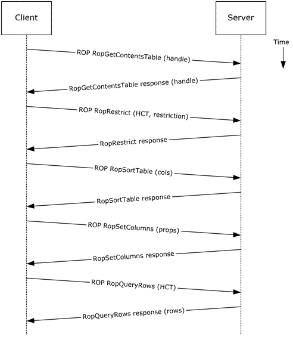
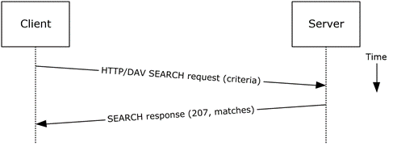
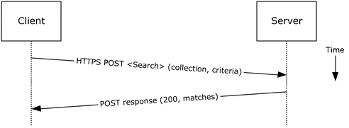
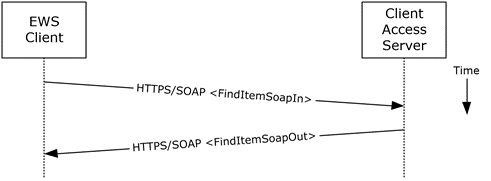

<html dir="LTR" xmlns:mshelp="http://msdn.microsoft.com/mshelp" xmlns:ddue="http://ddue.schemas.microsoft.com/authoring/2003/5" xmlns:xlink="http://www.w3.org/1999/xlink" xmlns:tool="http://www.microsoft.com/tooltip">
    <head>
        <meta http-equiv="Content-Type" content="text/html; CHARSET=utf-8"></meta>
        <meta name="save" content="history"></meta>
        <title>2.5.10.5 Protocol-Specific Details</title>
        <xml>
            <mshelp:toctitle title="2.5.10.5 Protocol-Specific Details"></mshelp:toctitle>
            <mshelp:rltitle title="[MS-OXPROTO]: Protocol-Specific Details"></mshelp:rltitle>
            <mshelp:keyword index="A" term="0f7656fe-992e-49af-85d9-9f0b85721d18"></mshelp:keyword>
            <mshelp:attr name="DCSext.ContentType" value="open specification"></mshelp:attr>
            <mshelp:attr name="AssetID" value="0f7656fe-992e-49af-85d9-9f0b85721d18"></mshelp:attr>
            <mshelp:attr name="TopicType" value="kbRef"></mshelp:attr>
            <mshelp:attr name="DCSext.Title" value="[MS-OXPROTO]: Protocol-Specific Details" />
        </xml>
    </head>
    <body>
        

            <h1 class="heading">2.5.10.5 Protocol-Specific Details</h1>
        

        

            

                

                

                    

Using <a href="f888c37a-d994-4b91-96a5-e88cfbd66bd6.htm#gt_3369fdd6-36f8-4a62-9cd7-2738ffb5048f">remote
operations (ROPs)</a>

<dl>
<dd>
<dl>
<dd>

</dd>
<dd>

<b>Figure 26: Finding folder items by
using ROPs</b>

</dd></dl></dd></dl>

<b>Note  </b>The ROPs are sent via <a href="f888c37a-d994-4b91-96a5-e88cfbd66bd6.htm#gt_8a7f6700-8311-45bc-af10-82e10accd331">RPC</a> or MAPI extensions for <a href="f888c37a-d994-4b91-96a5-e88cfbd66bd6.htm#gt_d72f1494-4917-4e9e-a9fd-b8f1b2758dcd">HTTP</a>. Several ROPs can be
batched into a single request, as described in <mshelp:link keywords="13af6911-27e5-4aa0-bb75-637b02d4f2ef" tabindex="0">[MS-OXCROPS]</mshelp:link>.

<ol><li>
    The client opens
the specified folder per the use case described in section <a href="c17348f9-48a3-48ca-a6d7-783f26af9159.htm">2.5.9</a>.

</li><li>
    The client
issues a <b>RopGetContentsTable</b> ROP request ([MS-OXCROPS] section <mshelp:link keywords="9149b2f4-6b72-4ea6-af96-f729698c94fa" tabindex="0">2.2.4.14</mshelp:link>)
with a <a href="f888c37a-d994-4b91-96a5-e88cfbd66bd6.htm#gt_5044babb-08e3-4bb9-bc12-fe8f542b05ee">handle</a> to the
folder for which to open the <a href="f888c37a-d994-4b91-96a5-e88cfbd66bd6.htm#gt_7fcf1c2a-e5de-4334-b349-2e8025798ac4">contents
table</a>.

</li><li>
    The Exchange
server responds with a handle to the contents table.

</li><li>
    The client
builds the search criteria by constructing a <a href="f888c37a-d994-4b91-96a5-e88cfbd66bd6.htm#gt_c434218b-574e-4d0d-b07c-d4806118574c">restriction</a>, as described
in <mshelp:link keywords="1afa0cd9-b1a0-4520-b623-bf15030af5d8" tabindex="0">[MS-OXCDATA]</mshelp:link>.

</li><li>
    The client
issues a <b>RopRestrict</b> ROP request ([MS-OXCROPS] section <mshelp:link keywords="aa45879e-93a4-470b-8a80-4cf7277706c6" tabindex="0">2.2.5.3</mshelp:link>)
with the constructed restriction to establish the search criteria.

</li><li>
    The Exchange
server responds to the <b>RopRestrict</b> ROP request.

</li><li>
    The client can
optionally issue a <b>RopSortTable</b> ROP request ([MS-OXCROPS] section <mshelp:link keywords="9ef2730d-fc11-4e88-a906-f671ed9fd50f" tabindex="0">2.2.5.2</mshelp:link>)
to specify a series of sort columns in the resulting table.

</li><li>
    The Exchange
server responds to the <b>RopSortTable</b> ROP request.

</li><li>
    The client
prepares a list of desired properties to retrieve and issues a <b>RopSetColumns</b>
ROP request ([MS-OXCROPS] section <mshelp:link keywords="fd4de516-8f1c-4994-a07e-7df782255095" tabindex="0">2.2.5.1</mshelp:link>)
to indicate the desired property columns.

</li><li>
  The Exchange server responds
to the <b>RopSetColumns</b> ROP request.

</li><li>
  The client issues a <b>RopQueryRows</b>
ROP request ([MS-OXCROPS] section <mshelp:link keywords="5b55f0d2-6304-4f8c-87dc-79786bbe5cd6" tabindex="0">2.2.5.4</mshelp:link>)
with a contents table handle (HCT) to retrieve rows from the contents table.

</li><li>
  The Exchange server responds
with a table of rows, where each row represents a message in the folder that
matches the search criteria from step 4, and each column corresponds to the
properties indicated in step 8.

</li></ol>
Using <a href="f888c37a-d994-4b91-96a5-e88cfbd66bd6.htm#gt_68024ef0-c00a-4ecf-8dba-42371b11bfeb">WebDAV</a>

<dl>
<dd>
<dl>
<dd>

</dd>
<dd>

<b>Figure 27: Finding folder items by
using WebDAV</b>

</dd></dl></dd></dl>

<ol><li>
    The client
issues a <b>SEARCH</b> method request, as described in <mshelp:link keywords="7bb6d0b6-8e78-4802-ab86-cecd7f91ec72" tabindex="0">[MS-WDVSE]</mshelp:link>,
to the Exchange server as the Request-URI, referencing the desired folder path
to perform the search. The search criteria are expressed in the XML body of the
request.

</li><li>
    The Exchange
server responds with HTTP status code 207 (Multi-Status) and a series of
responses, where each response corresponds to a matching entry in the folder.

</li></ol>
Using Exchange ActiveSync

<dl>
<dd>
<dl>
<dd>

</dd>
<dd>

<b>Figure 28: Finding folder items by
using Exchange ActiveSync</b>

</dd></dl></dd></dl>

<ol><li>
    The client
issues a <b>Search</b> command request, as described in <mshelp:link keywords="1a3490f1-afe1-418a-aa92-6f630036d65a" tabindex="0">[MS-ASCMD]</mshelp:link>
section <mshelp:link keywords="8211179b-14f3-44ab-9de6-b69ca2a48c4e" tabindex="0">2.2.1.16</mshelp:link>,
by specifying the name of the folder to be searched, and an XML query that
represents the search criteria.

</li><li>
    The Exchange
server responds with HTTP status code 200 (OK) and a collection of results,
where each result corresponds to an item in the folder that matches the search
criteria.

</li></ol>
Using Exchange Web Services

<dl>
<dd>
<dl>
<dd>

</dd>
<dd>

<b>Figure 29: Finding folder items by
using Exchange Web Services</b>

</dd></dl></dd></dl>

<ol><li>
    The client uses
the HTTPS/SOAP <b>FindItemSoapIn</b> request message, as described in <mshelp:link keywords="35f2a6fd-0801-43dd-b3a5-7a0bf60c0127" tabindex="0">[MS-OXWSSRCH]</mshelp:link>
section <mshelp:link keywords="a28439bf-dd48-4ff1-b16c-8d769fac8f79" tabindex="0">3.1.4.2.1.1</mshelp:link>,
to find specific items from one or more folders. The client can specify the
list of folders to search, the list of properties to return, the search
criteria, and the sort order of the results, among other options.

</li><li>
    The Client
Access server responds with a <b>FindItemSoapOut</b> response message, as
described in [MS-OXWSSRCH] section <mshelp:link keywords="666755ca-af3e-4148-bc2c-6821a6447be6" tabindex="0">3.1.4.2.1.2</mshelp:link>,
which includes the <b>ResponseCode</b> element specifying the status of the operation
and the set of items that match the search criteria.

</li></ol>
                

            

        

    </body>
</html>