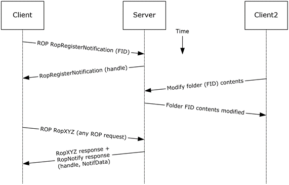
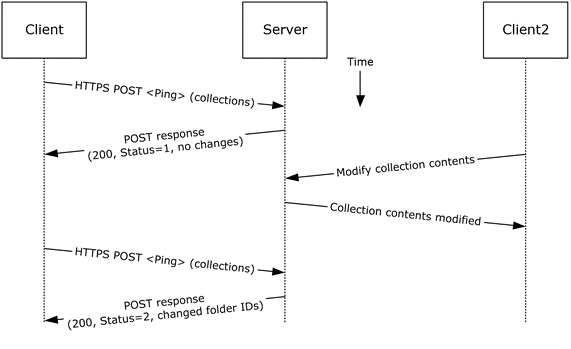
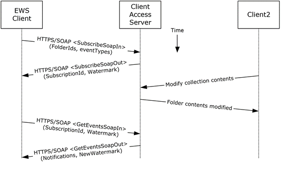

<html dir="LTR" xmlns:mshelp="http://msdn.microsoft.com/mshelp" xmlns:ddue="http://ddue.schemas.microsoft.com/authoring/2003/5" xmlns:xlink="http://www.w3.org/1999/xlink" xmlns:tool="http://www.microsoft.com/tooltip">
    <head>
        <meta http-equiv="Content-Type" content="text/html; CHARSET=utf-8"></meta>
        <meta name="save" content="history"></meta>
        <title>2.5.13.5 Protocol-Specific Details</title>
        <xml>
            <mshelp:toctitle title="2.5.13.5 Protocol-Specific Details"></mshelp:toctitle>
            <mshelp:rltitle title="[MS-OXPROTO]: Protocol-Specific Details"></mshelp:rltitle>
            <mshelp:keyword index="A" term="21af4f7a-bc8e-41f5-ba50-f74a80b55183"></mshelp:keyword>
            <mshelp:attr name="DCSext.ContentType" value="open specification"></mshelp:attr>
            <mshelp:attr name="AssetID" value="21af4f7a-bc8e-41f5-ba50-f74a80b55183"></mshelp:attr>
            <mshelp:attr name="TopicType" value="kbRef"></mshelp:attr>
            <mshelp:attr name="DCSext.Title" value="[MS-OXPROTO]: Protocol-Specific Details" />
        </xml>
    </head>
    <body>
        

            <h1 class="heading">2.5.13.5 Protocol-Specific Details</h1>
        

        

            

                

                

                    

Using <a href="f888c37a-d994-4b91-96a5-e88cfbd66bd6.htm#gt_3369fdd6-36f8-4a62-9cd7-2738ffb5048f">remote
operations (ROPs)</a>

<dl>
<dd>
<dl>
<dd>

</dd>
<dd>

<b>Figure 36: Registering for and
receiving notifications by using ROPs</b>

</dd></dl></dd></dl>

<b>Note  </b>The ROPs are sent via <a href="f888c37a-d994-4b91-96a5-e88cfbd66bd6.htm#gt_8a7f6700-8311-45bc-af10-82e10accd331">RPC</a> or MAPI extensions for <a href="f888c37a-d994-4b91-96a5-e88cfbd66bd6.htm#gt_d72f1494-4917-4e9e-a9fd-b8f1b2758dcd">HTTP</a>. Several ROPs can be
batched into a single request, as described in <mshelp:link keywords="13af6911-27e5-4aa0-bb75-637b02d4f2ef" tabindex="0">[MS-OXCROPS]</mshelp:link>.

<ol><li>
    The client logs
on to the <a href="f888c37a-d994-4b91-96a5-e88cfbd66bd6.htm#gt_d3ad0e15-adc9-4174-bacf-d929b57278b3">mailbox</a> per
the use case described in section <a href="073b1877-3b61-4cbe-bd4e-8e158a1a8795.htm">2.5.2</a>.

</li><li>
    The client issues
a <b>RopRegisterNotification</b> ROP request ([MS-OXCROPS] section <mshelp:link keywords="4eeb51bf-c574-40cb-a3d8-8604c4f7b52b" tabindex="0">2.2.14.1</mshelp:link>)
to register for notifications. The FID, as described in <mshelp:link keywords="1afa0cd9-b1a0-4520-b623-bf15030af5d8" tabindex="0">[MS-OXCDATA]</mshelp:link>
section <mshelp:link keywords="1c934e18-441b-4c47-9de0-eb34ffea47e3" tabindex="0">2.2.1.1</mshelp:link>,
of the folder to be monitored is included in the request.

</li><li>
    The Exchange
server responds with a handle to the notification.

</li><li>
    The next time
that the client issues a ROP request to the Exchange server, the server adds a <b>RopNotify</b>
ROP response ([MS-OXCROPS] section <mshelp:link keywords="53529946-12bb-4bbc-a969-9878354f239d" tabindex="0">2.2.14.2</mshelp:link>)
and a result code of <b>RopPending</b> is returned for the overall ROP
response.

</li><li>
    The client
examines the information in the <b>RopNotify</b> ROP response and triggers an <a href="f888c37a-d994-4b91-96a5-e88cfbd66bd6.htm#gt_472f97f2-82ec-4623-8e46-d348a7984967">event</a> on the client. For
example, a UI notification is triggered in response to a link that was added to
the body of a meeting invite.

</li></ol>
Using Exchange ActiveSync

<dl>
<dd>
<dl>
<dd>

</dd>
<dd>

<b>Figure 37: Registering for and
receiving notifications by using Exchange ActiveSync</b>

</dd></dl></dd></dl>

<ol><li>
    The client
issues a ping request to the Exchange server to check for events that have
occurred in the specified list of containers (folders).

</li><li>
    If no events
have occurred since the last ping, the Exchange server returns HTTP status code
200 (OK) and a status code of 1, as described in <mshelp:link keywords="1a3490f1-afe1-418a-aa92-6f630036d65a" tabindex="0">[MS-ASCMD]</mshelp:link>.
If events have occurred, the server returns HTTP status code 200 (OK) and a
status code of 2, followed by a list of FIDs that need to be synchronized.

</li></ol>
Using Exchange Web Services

<dl>
<dd>
<dl>
<dd>

</dd>
<dd>

<b>Figure 38: Registering for and
receiving notifications by using Exchange Web Services</b>

</dd></dl></dd></dl>

<ol><li>
    The client uses
the HTTPS/SOAP <b>SubscribeSoapIn</b> request, as described in <mshelp:link keywords="fcc4a799-daf0-4fdf-be8f-ae0aa39ae6a9" tabindex="0">[MS-OXWSNTIF]</mshelp:link>
section <mshelp:link keywords="b66f6b72-eb62-4b1e-852c-e59ab0067018" tabindex="0">3.1.4.3.1.1</mshelp:link>,
to subscribe to pull notifications for the types of events indicated in the <b>EventTypes</b>
element on a list of folders specified by the <b>FolderIds</b> element.

</li><li>
    The Client
Access server responds with a <b>SubscribeSoapOut</b> response, as described in
[MS-OXWSNTIF] section <mshelp:link keywords="2e54b29e-3dac-423b-93c1-375a27e9288b" tabindex="0">3.1.4.3.1.2</mshelp:link>,
which includes a <b>ResponseCode</b> element, a <b>SubscriptionId</b> element
that identifies this subscription, and a <b>Watermark</b> element that
indicates the current notification state.

</li><li>
    A second client
modifies the contents of a folder that has an active subscription. This causes
the server to create a pending notification associated with the subscription.

</li><li>
    The first client
uses the HTTPS/SOAP <b>GetEventsSoapIn</b> request, as described in
[MS-OXWSNTIF] section <mshelp:link keywords="7d41da9f-a63b-4c59-ba37-d05b24e51738" tabindex="0">3.1.4.1.1.1</mshelp:link>,
to query the server for any new notifications. The value of the <b>Watermark</b>
element allows the server to determine which new notifications, if any, to
return to the client.

</li><li>
    The Exchange
Client Access server responds with a <b>GetEventsSoapOut</b> response, as
described in [MS-OXWSNTIF] section <mshelp:link keywords="bbd52909-d6fa-4a13-bb9f-fff11ae72e6b" tabindex="0">3.1.4.1.1.2</mshelp:link>,
which includes a <b>Notifications</b> element listing the notifications that
were pending since the value of the <b>Watermark</b> element specified by the
client. A <b>Watermark</b> element is also returned to the client to indicate
the new notification state for the next <b>GetEventsSoapIn</b> call.

</li></ol>
                

            

        

    </body>
</html>