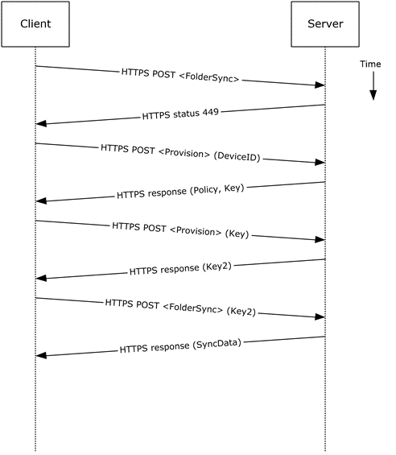

<html dir="LTR" xmlns:mshelp="http://msdn.microsoft.com/mshelp" xmlns:ddue="http://ddue.schemas.microsoft.com/authoring/2003/5" xmlns:xlink="http://www.w3.org/1999/xlink" xmlns:tool="http://www.microsoft.com/tooltip">
    <head>
        <meta http-equiv="Content-Type" content="text/html; CHARSET=utf-8"></meta>
        <meta name="save" content="history"></meta>
        <title>2.5.14.5 Protocol-Specific Details</title>
        <xml>
            <mshelp:toctitle title="2.5.14.5 Protocol-Specific Details"></mshelp:toctitle>
            <mshelp:rltitle title="[MS-OXPROTO]: Protocol-Specific Details"></mshelp:rltitle>
            <mshelp:keyword index="A" term="3764ce5a-8c53-4665-8cc7-07bafe0db341"></mshelp:keyword>
            <mshelp:attr name="DCSext.ContentType" value="open specification"></mshelp:attr>
            <mshelp:attr name="AssetID" value="3764ce5a-8c53-4665-8cc7-07bafe0db341"></mshelp:attr>
            <mshelp:attr name="TopicType" value="kbRef"></mshelp:attr>
            <mshelp:attr name="DCSext.Title" value="[MS-OXPROTO]: Protocol-Specific Details" />
        </xml>
    </head>
    <body>
        

            <h1 class="heading">2.5.14.5 Protocol-Specific Details</h1>
        

        

            

                

                

                    

Using Exchange ActiveSync

<dl>
<dd>
<dl>
<dd>

</dd>
<dd>

<b>Figure 39: Provisioning a mobile
client device by using Exchange ActiveSync</b>

</dd></dl></dd></dl>

<ol><li>
    A client without
a current policy attempts to synchronize with an Exchange server (in this case,
by issuing a <b>FolderSync</b> command request, as described in <mshelp:link keywords="1a3490f1-afe1-418a-aa92-6f630036d65a" tabindex="0">[MS-ASCMD]</mshelp:link>
section <mshelp:link keywords="e4dc4ff8-cf5a-41d9-abb8-6188068b0b9b" tabindex="0">2.2.1.5</mshelp:link>).

</li><li>
    The Exchange
server replies with HTTP status code 449 (Need Provisioning) to indicate that
the client's policy is not current.

</li><li>
    The client
issues a <b>Provision</b> command request ([MS-ASCMD] section <mshelp:link keywords="6e86936b-23a9-4bb9-b8bc-c562ccbd4b0f" tabindex="0">2.2.1.14</mshelp:link>)
to download the latest policy from the Exchange server, referencing its own
device ID for identification.

</li><li>
    The Exchange
server responds with an <a href="f888c37a-d994-4b91-96a5-e88cfbd66bd6.htm#gt_982b7f8e-d516-4fd5-8d5e-1a836081ed85">XML</a>
document representation of the current policy plus a temporary policy key.

</li><li>
    The client
issues a second <b>Provision </b>command request to acknowledge receipt of
policy settings in the initial server response.

</li><li>
    The Exchange
server responds with a policy key that can be used in subsequent command
requests.

</li><li>
    The client
issues a <b>FolderSync</b> command request to the Exchange server, including
the most recent policy key in the HTTP headers, as described in <mshelp:link keywords="449c453b-74d7-4919-bfe8-95972b27048a" tabindex="0">[MS-ASPROV]</mshelp:link>.

</li><li>
    The Exchange
server acknowledges the policy key and returns the <b>FolderSync</b>
information.

</li></ol>
                

            

        

    </body>
</html>