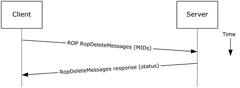
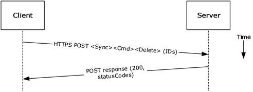
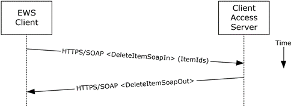

<html dir="LTR" xmlns:mshelp="http://msdn.microsoft.com/mshelp" xmlns:ddue="http://ddue.schemas.microsoft.com/authoring/2003/5" xmlns:xlink="http://www.w3.org/1999/xlink" xmlns:tool="http://www.microsoft.com/tooltip">
    <head>
        <meta http-equiv="Content-Type" content="text/html; CHARSET=utf-8"></meta>
        <meta name="save" content="history"></meta>
        <title>2.5.11.5 Protocol-Specific Details</title>
        <xml>
            <mshelp:toctitle title="2.5.11.5 Protocol-Specific Details"></mshelp:toctitle>
            <mshelp:rltitle title="[MS-OXPROTO]: Protocol-Specific Details"></mshelp:rltitle>
            <mshelp:keyword index="A" term="3ad20de1-db0a-4755-95f8-4ced260873e7"></mshelp:keyword>
            <mshelp:attr name="DCSext.ContentType" value="open specification"></mshelp:attr>
            <mshelp:attr name="AssetID" value="3ad20de1-db0a-4755-95f8-4ced260873e7"></mshelp:attr>
            <mshelp:attr name="TopicType" value="kbRef"></mshelp:attr>
            <mshelp:attr name="DCSext.Title" value="[MS-OXPROTO]: Protocol-Specific Details" />
        </xml>
    </head>
    <body>
        

            <h1 class="heading">2.5.11.5 Protocol-Specific Details</h1>
        

        

            

                

                

                    

Using <a href="f888c37a-d994-4b91-96a5-e88cfbd66bd6.htm#gt_3369fdd6-36f8-4a62-9cd7-2738ffb5048f">remote
operations (ROPs)</a>

<dl>
<dd>
<dl>
<dd>

</dd>
<dd>

<b>Figure 30: Deleting a message by
using ROPs</b>

</dd></dl></dd></dl>

<b>Note  </b>The ROPs are sent via <a href="f888c37a-d994-4b91-96a5-e88cfbd66bd6.htm#gt_8a7f6700-8311-45bc-af10-82e10accd331">RPC</a> or MAPI extensions for <a href="f888c37a-d994-4b91-96a5-e88cfbd66bd6.htm#gt_d72f1494-4917-4e9e-a9fd-b8f1b2758dcd">HTTP</a>. Several ROPs can be
batched into a single request, as described in <mshelp:link keywords="13af6911-27e5-4aa0-bb75-637b02d4f2ef" tabindex="0">[MS-OXCROPS]</mshelp:link>.

<ol><li>
    The client opens
the specified folder per the use case described in section <a href="c17348f9-48a3-48ca-a6d7-783f26af9159.htm">2.5.9</a>.

</li><li>
    The client
issues a <b>RopDeleteMessages</b> ROP request ([MS-OXCROPS] section <mshelp:link keywords="d53e1f62-c1b5-4559-bec7-e0f0b9b76ff7" tabindex="0">2.2.4.11</mshelp:link>)
with the list of MIDs to be deleted.

</li><li>
    The Exchange
server returns the success or failure of the operation.

</li></ol>
Using Exchange ActiveSync

<dl>
<dd>
<dl>
<dd>

</dd>
<dd>

<b>Figure 31: Deleting a message by
using Exchange ActiveSync</b>

</dd></dl></dd></dl>

<ol><li>
    The client
issues a <b>Sync </b>command request (<mshelp:link keywords="1a3490f1-afe1-418a-aa92-6f630036d65a" tabindex="0">[MS-ASCMD]</mshelp:link>
section <mshelp:link keywords="89449dc4-678c-4deb-9be2-e1dbbc43e2f5" tabindex="0">2.2.1.21</mshelp:link>),
with a <b>Delete</b> element, as described in [MS-ASCMD] section <mshelp:link keywords="cb0f05b8-456b-471f-8dd5-a2f86e6cdf88" tabindex="0">2.2.3.42.2</mshelp:link>,
to the server, where each item to be deleted is listed in the schematized XML
request body.

</li><li>
    The Exchange
server responds with HTTP status code 200 (OK) and returns a series of sync
status codes, where each corresponds to the deletion status for a message in
the deletion list.

</li></ol>
Using Exchange Web Services

<dl>
<dd>
<dl>
<dd>

</dd>
<dd>

<b>Figure 32: Deleting a message by
using Exchange Web Services</b>

</dd></dl></dd></dl>

<ol><li>
    The client uses
the HTTPS/SOAP <b>DeleteItemSoapIn</b> request <a href="f888c37a-d994-4b91-96a5-e88cfbd66bd6.htm#gt_d5ccdf11-3f53-4118-a845-dfaca61838fb">WSDL message</a>, as described
in <mshelp:link keywords="7a113138-a0db-4168-a164-bf8b05cc4e6d" tabindex="0">[MS-OXWSCORE]</mshelp:link>
section <mshelp:link keywords="411602df-10ec-4bd2-a1b5-47a13e6e2c7e" tabindex="0">3.1.4.3.1.1</mshelp:link>,
to delete items specified in the <b>ItemIds</b> element.

</li><li>
    The Exchange
Client Access server responds with a <b>DeleteItemSoapOut</b> response WSDL
message, as described in [MS-OXWSCORE] section <mshelp:link keywords="4ebca0ab-7877-49ac-880a-cc5142021c57" tabindex="0">3.1.4.3.1.2</mshelp:link>,
which includes a <b>ResponseCode</b> element for the deletion status of each
item.

</li></ol>
                

            

        

    </body>
</html>