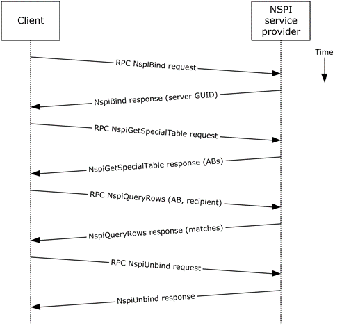
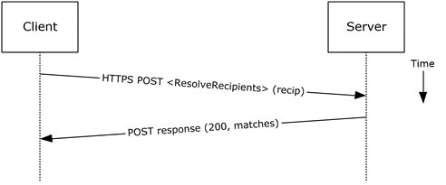
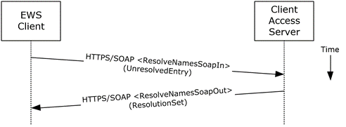

<html dir="LTR" xmlns:mshelp="http://msdn.microsoft.com/mshelp" xmlns:ddue="http://ddue.schemas.microsoft.com/authoring/2003/5" xmlns:xlink="http://www.w3.org/1999/xlink" xmlns:tool="http://www.microsoft.com/tooltip">
    <head>
        <meta http-equiv="Content-Type" content="text/html; CHARSET=utf-8"></meta>
        <meta name="save" content="history"></meta>
        <title>2.5.6.5 Protocol-Specific Details</title>
        <xml>
            <mshelp:toctitle title="2.5.6.5 Protocol-Specific Details"></mshelp:toctitle>
            <mshelp:rltitle title="[MS-OXPROTO]: Protocol-Specific Details"></mshelp:rltitle>
            <mshelp:keyword index="A" term="4806d9d5-857b-457d-ae92-a4eed4c12419"></mshelp:keyword>
            <mshelp:attr name="DCSext.ContentType" value="open specification"></mshelp:attr>
            <mshelp:attr name="AssetID" value="4806d9d5-857b-457d-ae92-a4eed4c12419"></mshelp:attr>
            <mshelp:attr name="TopicType" value="kbRef"></mshelp:attr>
            <mshelp:attr name="DCSext.Title" value="[MS-OXPROTO]: Protocol-Specific Details" />
        </xml>
    </head>
    <body>
        

            <h1 class="heading">2.5.6.5 Protocol-Specific Details</h1>
        

        

            

                

                

                    

Using <a href="f888c37a-d994-4b91-96a5-e88cfbd66bd6.htm#gt_8a7f6700-8311-45bc-af10-82e10accd331">RPC</a>

<dl>
<dd>
<dl>
<dd>
<dl>
<dd>

</dd>
<dd>

<b>Figure 19: Resolving a recipient
from an address book by using RPC</b>

</dd></dl></dd></dl></dd></dl>

<ol><li>
    The client
creates an RPC connection with NSPI and issues an <b>NspiBind</b> method
request, as described in <mshelp:link keywords="6dd0a3ea-b4d4-4a73-a857-add03a89a543" tabindex="0">[MS-NSPI]</mshelp:link>.

</li><li>
    NSPI responds to
the <b>NspiBind</b> method request and returns a server <a href="f888c37a-d994-4b91-96a5-e88cfbd66bd6.htm#gt_f49694cc-c350-462d-ab8e-816f0103c6c1">GUID</a>.

</li><li>
    The client then
issues an <b>NspiGetSpecialTable</b> method request to obtain the hierarchy
table.

</li><li>
    NSPI returns a
table of rows, where each row represents an <a href="f888c37a-d994-4b91-96a5-e88cfbd66bd6.htm#gt_d16f7b78-c5a6-48f4-9e0f-3b205b5598b5">address book</a> container.

</li><li>
    The client
issues an <b>NspiQueryRows</b> method request to identify address book entries
that match a specific recipient.

</li><li>
    NSPI returns a
table of zero or more rows, where each row represents the information for a
matching address book entry. If no matches are found, no rows are returned.

</li><li>
    The client
issues an <b>NspiUnbind</b> method request to terminate the conversation.

</li><li>
    The server
acknowledges the termination by responding to the <b>NspiUnbind </b>method
request.

<b>Note  </b>If no
rows are returned, a match was not found for the recipient. If a single row is
returned, an exact match was found. If more than one row is returned, the
recipient name in question is considered to be ambiguous. It is the
responsibility of the end user to determine the correct recipient from the list
of ambiguous recipient names.

</li></ol>
Using Exchange ActiveSync

<dl>
<dd>
<dl>
<dd>
<dl>
<dd>

</dd>
<dd>

<b>Figure 20: Resolving a recipient
from an address book by using Exchange ActiveSync</b>

</dd></dl></dd></dl></dd></dl>

<ol><li>
    The client
issues a <b>ResolveRecipients</b> command request, as described in <mshelp:link keywords="1a3490f1-afe1-418a-aa92-6f630036d65a" tabindex="0">[MS-ASCMD]</mshelp:link>
section <mshelp:link keywords="af10e71b-adf1-40e9-8074-cccd9a4889a2" tabindex="0">2.2.1.15</mshelp:link>,
for the specific recipient to the server.

</li><li>
    The Exchange
server responds to the request by returning HTTP status code 200 (OK) and a
sequence of complex elements, each representing a matching recipient in the
address book. A sequence of zero elements indicates that a match for the
recipient was not found.

</li></ol>
Using Exchange Web Services

<dl>
<dd>
<dl>
<dd>
<dl>
<dd>

</dd>
<dd>

<b>Figure 21: Resolving a recipient
from an address book by using Exchange Web Services</b>

</dd></dl></dd></dl></dd></dl>

<ol><li>
    The client uses
the HTTPS/SOAP <b>ResolveNamesSoapIn</b> request message, as described in <mshelp:link keywords="0665e7dc-7b68-48d7-83ff-7aa94edbe362" tabindex="0">[MS-OXWSRSLNM]</mshelp:link>
section <mshelp:link keywords="7f63fcc8-7a3b-438f-a143-b3d645e6fef7" tabindex="0">3.1.4.1.1.1</mshelp:link>,
to resolve an unresolved entry.

</li><li>
    The Client
Access server responds with a <b>ResolveNamesSoapOut</b> response message, as
described in [MS-OXWSRSLNM] section <mshelp:link keywords="d07f6537-636d-4b60-ae6a-7140e4c02100" tabindex="0">3.1.4.1.1.2</mshelp:link>,
which includes the <b>ResponseCode</b> element and the <b>ResolutionSet</b>
element, as described in [MS-OXWSRSLNM] section <mshelp:link keywords="c2983809-41db-438f-a778-3ba526dadc6e" tabindex="0">3.1.4.1.3.3</mshelp:link>,
containing the list of matching names found in the resolution set.

</li></ol>
                

            

        

    </body>
</html>