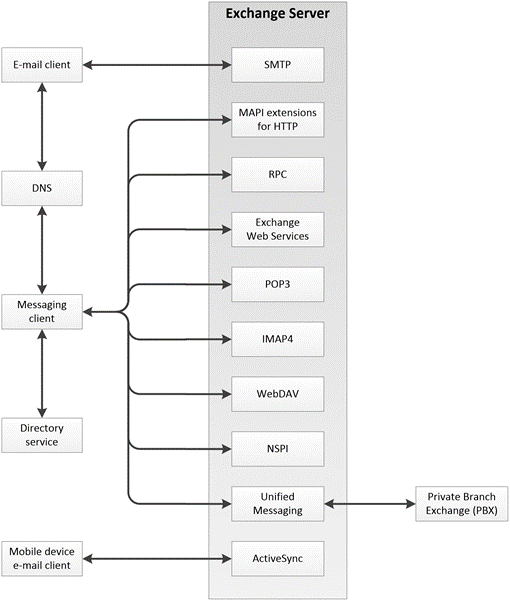

<html dir="LTR" xmlns:mshelp="http://msdn.microsoft.com/mshelp" xmlns:ddue="http://ddue.schemas.microsoft.com/authoring/2003/5" xmlns:xlink="http://www.w3.org/1999/xlink" xmlns:tool="http://www.microsoft.com/tooltip">
    <head>
        <meta http-equiv="Content-Type" content="text/html; CHARSET=utf-8"></meta>
        <meta name="save" content="history"></meta>
        <title>2.1 Overview</title>
        <xml>
            <mshelp:toctitle title="2.1 Overview"></mshelp:toctitle>
            <mshelp:rltitle title="[MS-OXPROTO]: Overview"></mshelp:rltitle>
            <mshelp:keyword index="A" term="5568006a-3827-4faf-a29b-41394780860a"></mshelp:keyword>
            <mshelp:attr name="DCSext.ContentType" value="open specification"></mshelp:attr>
            <mshelp:attr name="AssetID" value="5568006a-3827-4faf-a29b-41394780860a"></mshelp:attr>
            <mshelp:attr name="TopicType" value="kbRef"></mshelp:attr>
            <mshelp:attr name="DCSext.Title" value="[MS-OXPROTO]: Overview" />
        </xml>
    </head>
    <body>
        

            <h1 class="heading">2.1 Overview</h1>
        

        

            

                

                

                    

The Microsoft Exchange Server system from a protocols
perspective, where the server provides protocols for clients, is illustrated in
the following figure. The clients that interoperate with the server perform
messaging tasks, and ancillary entities provide essential supporting services.

<b>Figure 2: Functional architecture</b>

Each protocol exposes a set of functionality that pertains
to specific classes of operations. For example, the <a href="f888c37a-d994-4b91-96a5-e88cfbd66bd6.htm#gt_0678be67-e739-4e33-97fe-2b03b903a379">Simple Mail Transfer Protocol
(SMTP)</a>, the <a href="f888c37a-d994-4b91-96a5-e88cfbd66bd6.htm#gt_8ef66909-36c3-4370-b455-d73a73562a6b">Post Office
Protocol - Version 3 (POP3)</a>, and the <a href="f888c37a-d994-4b91-96a5-e88cfbd66bd6.htm#gt_ee8c9703-9e1d-43bc-9491-03050a18ff7f">Internet Message Access
Protocol - Version 4 (IMAP4)</a> constitute a set of Internet Standard
protocols that simple e-mail clients use to send, retrieve, and manage e-mail
messages; Exchange Web Services offers a standardized interface for middle-tier
applications to build value-added services; the <a href="f888c37a-d994-4b91-96a5-e88cfbd66bd6.htm#gt_68024ef0-c00a-4ecf-8dba-42371b11bfeb">Web Distributed Authoring and
Versioning Protocol (WebDAV)</a> provides a set of interfaces that caters to
distributed authoring; and the remote operations (ROPs) along with either the <a href="f888c37a-d994-4b91-96a5-e88cfbd66bd6.htm#gt_8a7f6700-8311-45bc-af10-82e10accd331">remote procedure call (RPC)</a>
interface or the MAPI extensions for HTTP provide all of the above as well as
direct access to storage and retrieval services.

In the simplest sense, the Exchange server operates under
the common client-server architecture, where a messaging client connects to an
Exchange server by using one or more of the available protocols. The client
performs tasks by issuing a series of requests to the server and processing
server responses. Behind the simplicity of the client-server architecture lies
functionality from basic storage to accessing, updating, and synchronizing <a href="f888c37a-d994-4b91-96a5-e88cfbd66bd6.htm#gt_d16f7b78-c5a6-48f4-9e0f-3b205b5598b5">address books</a>,
appointments, and shared folders. 

An Exchange server can be regarded as having two functional
elements: a <a href="f888c37a-d994-4b91-96a5-e88cfbd66bd6.htm#gt_fda94a53-448d-48d5-9991-176c530ff597">message store</a>
and a message processing system. These functions are explained in more detail
in section <a href="8a1be138-34c0-44ef-b7c9-4ced4021998c.htm">2.1.1</a> and
section <a href="d4d96df4-026c-4255-b3f6-6dea319ce501.htm">2.1.2</a>.

                

            

        

    </body>
</html>