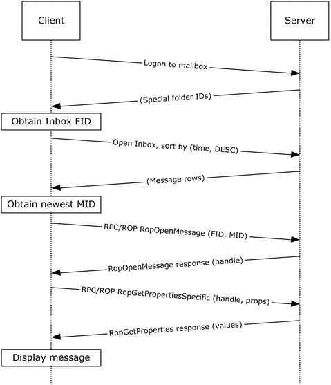

<html dir="LTR" xmlns:mshelp="http://msdn.microsoft.com/mshelp" xmlns:ddue="http://ddue.schemas.microsoft.com/authoring/2003/5" xmlns:xlink="http://www.w3.org/1999/xlink" xmlns:tool="http://www.microsoft.com/tooltip">
    <head>
        <meta http-equiv="Content-Type" content="text/html; CHARSET=utf-8"></meta>
        <meta name="save" content="history"></meta>
        <title>3.1.5 Details</title>
        <xml>
            <mshelp:toctitle title="3.1.5 Details"></mshelp:toctitle>
            <mshelp:rltitle title="[MS-OXPROTO]: Details"></mshelp:rltitle>
            <mshelp:keyword index="A" term="58b7f124-30ce-42d6-a187-188776505c67"></mshelp:keyword>
            <mshelp:attr name="DCSext.ContentType" value="open specification"></mshelp:attr>
            <mshelp:attr name="AssetID" value="58b7f124-30ce-42d6-a187-188776505c67"></mshelp:attr>
            <mshelp:attr name="TopicType" value="kbRef"></mshelp:attr>
            <mshelp:attr name="DCSext.Title" value="[MS-OXPROTO]: Details" />
        </xml>
    </head>
    <body>
        

            <h1 class="heading">3.1.5 Details</h1>
        

        

            

                

                

                    

<dl>
<dd>
<dl>
<dd>

</dd>
<dd>

<b>Figure 40: Display message steps</b>

</dd></dl></dd></dl>

<ol><li>
    The client logs
on to the <a href="f888c37a-d994-4b91-96a5-e88cfbd66bd6.htm#gt_d3ad0e15-adc9-4174-bacf-d929b57278b3">mailbox</a> per
the use case described in section <a href="073b1877-3b61-4cbe-bd4e-8e158a1a8795.htm">2.5.2</a>.

</li><li>
    The client
obtains the FID for the <a href="f888c37a-d994-4b91-96a5-e88cfbd66bd6.htm#gt_baa08600-0402-47f6-a8ce-9690cf962c96">Inbox
folder</a> from the server as a result of successful logon.

</li><li>
    Based on the use
case described in section <a href="ca1975f0-c908-4916-86c8-ea3ddc011b45.htm">2.5.10</a>,
the client queries the message rows in the Inbox folder and sorts the rows by
message date (the <b>PidTagMessageDeliveryTime </b>property, as described in <mshelp:link keywords="daa9120f-f325-4afb-a738-28f91049ab3c" tabindex="0">[MS-OXOMSG]</mshelp:link>
section <mshelp:link keywords="b3f7aeb9-d0c2-4ab8-9019-6124683d2dfd" tabindex="0">2.2.3.9</mshelp:link>)
in descending order. The resulting table contains a column for the MID (the <b>PidTagMid</b>
property, as described in <mshelp:link keywords="b9752f3d-d50d-44b8-9e6b-608a117c8532" tabindex="0">[MS-OXCFXICS]</mshelp:link>
section <mshelp:link keywords="454b476f-d97b-41f1-972d-f771b56ae5e8" tabindex="0">2.2.1.2.1</mshelp:link>).

</li><li>
    The first row in
the Inbox folder contents table contains information about the newest message.
The client extracts the MID of the newest message from the <b>PidTagMid</b>
property column.

</li><li>
    The client
issues a <b>RopOpenMessage</b> <a href="f888c37a-d994-4b91-96a5-e88cfbd66bd6.htm#gt_3369fdd6-36f8-4a62-9cd7-2738ffb5048f">ROP</a> request (<mshelp:link keywords="13af6911-27e5-4aa0-bb75-637b02d4f2ef" tabindex="0">[MS-OXCROPS]</mshelp:link>
section <mshelp:link keywords="90766cc2-f5b3-4d87-9f85-20a61bd7c760" tabindex="0">2.2.6.1</mshelp:link>)
with the inbox FID and the MID returned. The Exchange server returns a handle
to the opened message.

</li><li>
    The client
issues a <b>RopGetPropertiesSpecific</b> ROP request ([MS-OXCROPS] section <mshelp:link keywords="dd6d164d-12ab-4cf4-ade3-dd14b295780d" tabindex="0">2.2.8.3</mshelp:link>)
with the message handle to retrieve the body of the message (the <b>PidTagBody </b>property,
as described in <mshelp:link keywords="7fd7ec40-deec-4c06-9493-1bc06b349682" tabindex="0">[MS-OXCMSG]</mshelp:link>
section <mshelp:link keywords="f4a2d583-1033-4daf-a9eb-3e03688a194c" tabindex="0">2.2.1.56.1</mshelp:link>)
and other properties required for displaying the message. 

</li><li>
    The client
displays the message using the property values returned by the Exchange server.

</li></ol>
                

            

        

    </body>
</html>