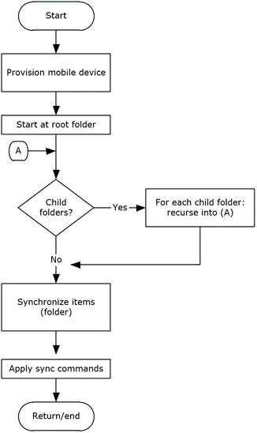

<html dir="LTR" xmlns:mshelp="http://msdn.microsoft.com/mshelp" xmlns:ddue="http://ddue.schemas.microsoft.com/authoring/2003/5" xmlns:xlink="http://www.w3.org/1999/xlink" xmlns:tool="http://www.microsoft.com/tooltip">
    <head>
        <meta http-equiv="Content-Type" content="text/html; CHARSET=utf-8"></meta>
        <meta name="save" content="history"></meta>
        <title>3.5.5 Details</title>
        <xml>
            <mshelp:toctitle title="3.5.5 Details"></mshelp:toctitle>
            <mshelp:rltitle title="[MS-OXPROTO]: Details"></mshelp:rltitle>
            <mshelp:keyword index="A" term="5f6ed96a-4ee3-416a-8a9d-59d835b86195"></mshelp:keyword>
            <mshelp:attr name="DCSext.ContentType" value="open specification"></mshelp:attr>
            <mshelp:attr name="AssetID" value="5f6ed96a-4ee3-416a-8a9d-59d835b86195"></mshelp:attr>
            <mshelp:attr name="TopicType" value="kbRef"></mshelp:attr>
            <mshelp:attr name="DCSext.Title" value="[MS-OXPROTO]: Details" />
        </xml>
    </head>
    <body>
        

            <h1 class="heading">3.5.5 Details</h1>
        

        

            

                

                

                    

<dl>
<dd>
<dl>
<dd>

</dd>
<dd>

<b>Figure 43: Provisioning and
synchronizing a mobile device</b>

</dd></dl></dd></dl>

<ol><li>
    The client
undergoes the provisioning process per the use case described in section <a href="c2474f75-ece8-4fc9-bf9e-30ffe4c45432.htm">2.5.14</a> to obtain the
current policy and policy key. At this point, the <b>FolderSync</b> command, as
described in <mshelp:link keywords="1a3490f1-afe1-418a-aa92-6f630036d65a" tabindex="0">[MS-ASCMD]</mshelp:link>
section <mshelp:link keywords="e4dc4ff8-cf5a-41d9-abb8-6188068b0b9b" tabindex="0">2.2.1.5</mshelp:link>,
would have caused the folder hierarchy to be created on the client. However,
the contents in the folders are not synchronized yet.

</li><li>
    The client
recursively walks the folder hierarchy and performs a per-folder
synchronization to download the folder contents per the use case described in
section <a href="c6b47c0c-7d1c-4b2e-b78d-75b41f0de85b.htm">2.5.12</a>.

</li></ol>
                

            

        

    </body>
</html>