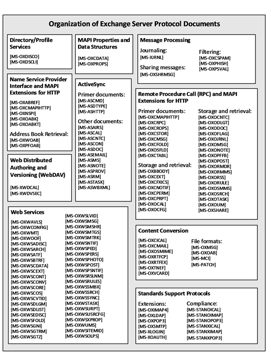

<html dir="LTR" xmlns:mshelp="http://msdn.microsoft.com/mshelp" xmlns:ddue="http://ddue.schemas.microsoft.com/authoring/2003/5" xmlns:xlink="http://www.w3.org/1999/xlink" xmlns:tool="http://www.microsoft.com/tooltip">
    <head>
        <meta http-equiv="Content-Type" content="text/html; CHARSET=utf-8"></meta>
        <meta name="save" content="history"></meta>
        <title>1 Introduction</title>
        <xml>
            <mshelp:toctitle title="1 Introduction"></mshelp:toctitle>
            <mshelp:rltitle title="[MS-OXPROTO]: Introduction"></mshelp:rltitle>
            <mshelp:keyword index="A" term="665212ea-222d-42cb-96f0-d285485cb277"></mshelp:keyword>
            <mshelp:attr name="DCSext.ContentType" value="open specification"></mshelp:attr>
            <mshelp:attr name="AssetID" value="665212ea-222d-42cb-96f0-d285485cb277"></mshelp:attr>
            <mshelp:attr name="TopicType" value="kbRef"></mshelp:attr>
            <mshelp:attr name="DCSext.Title" value="[MS-OXPROTO]: Introduction" />
        </xml>
    </head>
    <body>
        

            <h1 class="heading">1 Introduction</h1>
        

        

            

                

                

                    

Microsoft Exchange Server provides a rich set of interfaces
with which messaging clients can interoperate. A messaging client can connect
to a computer that is running Microsoft Exchange by using one or more of the
available protocols and perform tasks by issuing requests to the server and
processing server responses.

The technical requirements, limitations, dependencies, and
Microsoft-specific protocol behavior of the protocols that are used in
Microsoft Exchange are described by the Microsoft Exchange protocol
documentation set. The documentation set can be broken down into functional
groups as illustrated in the following diagram.

<b>Figure 1: Organization of Microsoft Exchange protocol
documents</b>

For information about the protocols described by each of
these documents, see section <a href="4c492f56-ef95-4c8d-b505-e3c55c364c61.htm">2.2</a>.

                

            

        

    </body>
</html>