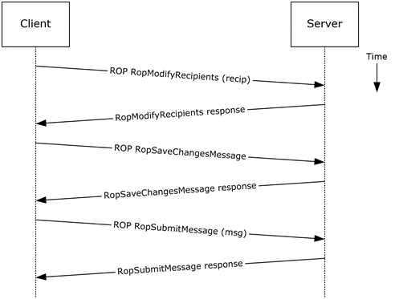
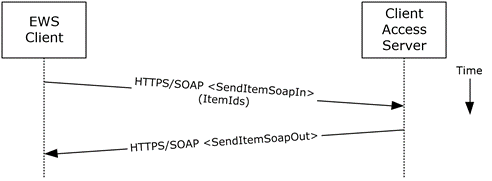

<html dir="LTR" xmlns:mshelp="http://msdn.microsoft.com/mshelp" xmlns:ddue="http://ddue.schemas.microsoft.com/authoring/2003/5" xmlns:xlink="http://www.w3.org/1999/xlink" xmlns:tool="http://www.microsoft.com/tooltip">
    <head>
        <meta http-equiv="Content-Type" content="text/html; CHARSET=utf-8"></meta>
        <meta name="save" content="history"></meta>
        <title>2.5.7.5 Protocol-Specific Details</title>
        <xml>
            <mshelp:toctitle title="2.5.7.5 Protocol-Specific Details"></mshelp:toctitle>
            <mshelp:rltitle title="[MS-OXPROTO]: Protocol-Specific Details"></mshelp:rltitle>
            <mshelp:keyword index="A" term="6da3f5e2-b84d-4b47-bbb6-c284effce199"></mshelp:keyword>
            <mshelp:attr name="DCSext.ContentType" value="open specification"></mshelp:attr>
            <mshelp:attr name="AssetID" value="6da3f5e2-b84d-4b47-bbb6-c284effce199"></mshelp:attr>
            <mshelp:attr name="TopicType" value="kbRef"></mshelp:attr>
            <mshelp:attr name="DCSext.Title" value="[MS-OXPROTO]: Protocol-Specific Details" />
        </xml>
    </head>
    <body>
        

            <h1 class="heading">2.5.7.5 Protocol-Specific Details</h1>
        

        

            

                

                

                    

Using <a href="f888c37a-d994-4b91-96a5-e88cfbd66bd6.htm#gt_3369fdd6-36f8-4a62-9cd7-2738ffb5048f">remote
operations (ROPs)</a>

<dl>
<dd>
<dl>
<dd>

</dd>
<dd>

<b>Figure 22: Sending a message by
using ROPs</b>

</dd></dl></dd></dl>

<b>Note  </b>The ROPs are sent via <a href="f888c37a-d994-4b91-96a5-e88cfbd66bd6.htm#gt_8a7f6700-8311-45bc-af10-82e10accd331">RPC</a> or MAPI extensions for <a href="f888c37a-d994-4b91-96a5-e88cfbd66bd6.htm#gt_d72f1494-4917-4e9e-a9fd-b8f1b2758dcd">HTTP</a>. Several ROPs can be
batched into a single request, as described in <mshelp:link keywords="13af6911-27e5-4aa0-bb75-637b02d4f2ef" tabindex="0">[MS-OXCROPS]</mshelp:link>.

<ol><li>
    The client
creates a message per the use case described in section <a href="9f011f97-a468-422c-a65d-0df484b07106.htm">2.5.3</a>.

</li><li>
    The client
resolves a recipient per the use case described in section <a href="4d562c60-77cc-4261-b858-d3e5b08eef0f.htm">2.5.6</a>.

</li><li>
    The client
issues a <b>RopModifyRecipients</b> ROP request ([MS-OXCROPS] section <mshelp:link keywords="89a0d8c5-a102-441c-a0e3-0f9f02d6c604" tabindex="0">2.2.6.5</mshelp:link>)
to add the recipient to the recipient table for the message.

</li><li>
    The Exchange
server returns the success or failure of the operation.

</li><li>
    The client
issues a <b>RopSaveChangesMessage</b> ROP request ([MS-OXCROPS] section <mshelp:link keywords="1ea61240-513a-4367-bc09-cbb21ed82999" tabindex="0">2.2.6.3</mshelp:link>)
to save the new recipient table.

</li><li>
    The Exchange
server returns the success or failure of the operation.

</li><li>
    The client
issues a <b>RopSubmitMessage</b> ROP request ([MS-OXCROPS] section <mshelp:link keywords="5723e77a-42ca-4565-a84f-79f32284c346" tabindex="0">2.2.7.1</mshelp:link>)
to submit the message for delivery.

</li><li>
    The Exchange
server returns the success or failure of the operation.

</li></ol>
Using Exchange Web Services

<dl>
<dd>
<dl>
<dd>

</dd>
<dd>

<b>Figure 23: Sending a message by
using Exchange Web Services</b>

</dd></dl></dd></dl>

<ol><li>
    The client uses
the HTTPS/SOAP <b>SendItemSoapIn</b> request <a href="f888c37a-d994-4b91-96a5-e88cfbd66bd6.htm#gt_d5ccdf11-3f53-4118-a845-dfaca61838fb">WSDL message</a>, as described
in <mshelp:link keywords="7a113138-a0db-4168-a164-bf8b05cc4e6d" tabindex="0">[MS-OXWSCORE]</mshelp:link>
section <mshelp:link keywords="ac58f6e2-c826-4af0-a037-183ef946f170" tabindex="0">3.1.4.8.1.1</mshelp:link>,
to specify a list of messages in the <b>ItemIds</b> element. It is assumed that
that each item specified in the <b>ItemIds</b> element already contains the
necessary sender and recipient information.

</li><li>
    The Exchange
Client Access server responds with a <b>SendItemSoapOut</b> response WSDL
message, as described in [MS-OXWSCORE] section <mshelp:link keywords="8b9e18ad-9828-4e3c-8fc6-98df7e548480" tabindex="0">3.1.4.8.1.2</mshelp:link>,
which includes the <b>ResponseCode</b> element specifying the status of the
operation.

</li></ol>
                

            

        

    </body>
</html>