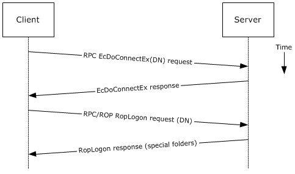
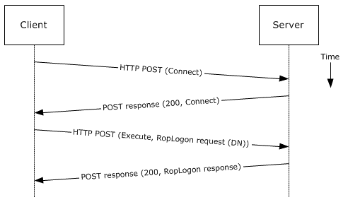

<html dir="LTR" xmlns:mshelp="http://msdn.microsoft.com/mshelp" xmlns:ddue="http://ddue.schemas.microsoft.com/authoring/2003/5" xmlns:xlink="http://www.w3.org/1999/xlink" xmlns:tool="http://www.microsoft.com/tooltip">
    <head>
        <meta http-equiv="Content-Type" content="text/html; CHARSET=utf-8"></meta>
        <meta name="save" content="history"></meta>
        <title>2.5.2.5 Protocol-Specific Details</title>
        <xml>
            <mshelp:toctitle title="2.5.2.5 Protocol-Specific Details"></mshelp:toctitle>
            <mshelp:rltitle title="[MS-OXPROTO]: Protocol-Specific Details"></mshelp:rltitle>
            <mshelp:keyword index="A" term="72cb276a-a76d-498b-9ed5-d4f8351461c7"></mshelp:keyword>
            <mshelp:attr name="DCSext.ContentType" value="open specification"></mshelp:attr>
            <mshelp:attr name="AssetID" value="72cb276a-a76d-498b-9ed5-d4f8351461c7"></mshelp:attr>
            <mshelp:attr name="TopicType" value="kbRef"></mshelp:attr>
            <mshelp:attr name="DCSext.Title" value="[MS-OXPROTO]: Protocol-Specific Details" />
        </xml>
    </head>
    <body>
        

            <h1 class="heading">2.5.2.5 Protocol-Specific Details</h1>
        

        

            

                

                

                    

Using <a href="f888c37a-d994-4b91-96a5-e88cfbd66bd6.htm#gt_8a7f6700-8311-45bc-af10-82e10accd331">RPC</a>

<dl>
<dd>
<dl>
<dd>

<b></b>

</dd>
<dd>

<b>Figure 7: Logging on to a mailbox
by using RPC</b>

</dd></dl></dd></dl>

<ol><li>
    The client uses
the discovery process from the use case described in section <a href="035bf52d-4f77-4310-b445-d63512076691.htm">2.5.1</a> to identify the
appropriate server.

</li><li>
    The client
connects to the Exchange server via RPC and issues an <b>EcDoConnectEx</b>
call, as described in <mshelp:link keywords="137f0ce2-31fd-4952-8a7d-6c0b242e4b6a" tabindex="0">[MS-OXCRPC]</mshelp:link>
section <mshelp:link keywords="59d638fe-e63d-422a-b51d-6210b2155138" tabindex="0">3.1.4.1</mshelp:link>,
along with the client's version information.

</li><li>
    The Exchange
server accepts the connection request and responds with the server version and
other connection information.

</li><li>
    The client
issues a <b>EcDoRpcExt2</b> call that includes the <b>RopLogon</b> <a href="f888c37a-d994-4b91-96a5-e88cfbd66bd6.htm#gt_3369fdd6-36f8-4a62-9cd7-2738ffb5048f">remote operation (ROP)</a>
request (<mshelp:link keywords="13af6911-27e5-4aa0-bb75-637b02d4f2ef" tabindex="0">[MS-OXCROPS]</mshelp:link>
section <mshelp:link keywords="f99f4c93-9ead-4cf0-ab85-c6dc3ce3acd7" tabindex="0">2.2.3.1</mshelp:link>)
to attempt to log on to the mailbox DN.

</li><li>
    Upon successful
logon, the Exchange server returns a list of special folder IDs, as described
in <mshelp:link keywords="1afa0cd9-b1a0-4520-b623-bf15030af5d8" tabindex="0">[MS-OXCDATA]</mshelp:link>
section <mshelp:link keywords="1c934e18-441b-4c47-9de0-eb34ffea47e3" tabindex="0">2.2.1.1</mshelp:link>,
depending on the logon action requested by the client.

</li></ol>
Using MAPI extensions for <a href="f888c37a-d994-4b91-96a5-e88cfbd66bd6.htm#gt_d72f1494-4917-4e9e-a9fd-b8f1b2758dcd">HTTP</a>

<dl>
<dd>
<dl>
<dd>

<b></b>

</dd>
<dd>

<b>Figure 8: Logging on to a mailbox
by using MAPI extensions for HTTP</b>

</dd></dl></dd></dl>

<ol><li>
    The client uses
the discovery process from the use case described in section 2.5.1 to identify
the appropriate server.

</li><li>
    The client
connects to the Exchange server via MAPI extensions for HTTP and issues a <b>Connect</b>
request type, as described in <mshelp:link keywords="d502edcf-0b22-42f2-8500-019f00d60245" tabindex="0">[MS-OXCMAPIHTTP]</mshelp:link>
section <mshelp:link keywords="83a9bbd6-a00e-4d3c-8ca4-f80259715aa3" tabindex="0">2.2.4.1</mshelp:link>,
along with the client's version information.

</li><li>
    The Exchange
server accepts the connection request and responds with the server version and
other connection information.

</li><li>
    The client
issues an <b>Execute</b> request type, as described in [MS-OXCMAPIHTTP] section
<mshelp:link keywords="56eda658-9456-49c1-a2df-02a0a892425a" tabindex="0">2.2.4.2</mshelp:link>,
that includes the <b>RopLogon</b> remote operation (ROP) request ([MS-OXCROPS]
section 2.2.3.1) to attempt to log on to the mailbox DN.

</li><li>
    Upon successful
logon, the Exchange server returns a list of special folder IDs, as described
in [MS-OXCDATA] section 2.2.1.1, depending on the logon action requested by the
client.

</li></ol>
                

            

        

    </body>
</html>