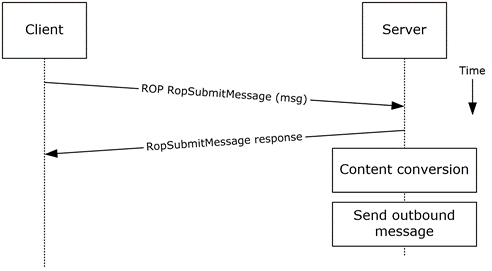

<html dir="LTR" xmlns:mshelp="http://msdn.microsoft.com/mshelp" xmlns:ddue="http://ddue.schemas.microsoft.com/authoring/2003/5" xmlns:xlink="http://www.w3.org/1999/xlink" xmlns:tool="http://www.microsoft.com/tooltip">
    <head>
        <meta http-equiv="Content-Type" content="text/html; CHARSET=utf-8"></meta>
        <meta name="save" content="history"></meta>
        <title>2.5.8.5 Protocol-Specific Details</title>
        <xml>
            <mshelp:toctitle title="2.5.8.5 Protocol-Specific Details"></mshelp:toctitle>
            <mshelp:rltitle title="[MS-OXPROTO]: Protocol-Specific Details"></mshelp:rltitle>
            <mshelp:keyword index="A" term="7636f6fd-7546-43dd-b13f-4572631c9c93"></mshelp:keyword>
            <mshelp:attr name="DCSext.ContentType" value="open specification"></mshelp:attr>
            <mshelp:attr name="AssetID" value="7636f6fd-7546-43dd-b13f-4572631c9c93"></mshelp:attr>
            <mshelp:attr name="TopicType" value="kbRef"></mshelp:attr>
            <mshelp:attr name="DCSext.Title" value="[MS-OXPROTO]: Protocol-Specific Details" />
        </xml>
    </head>
    <body>
        

            <h1 class="heading">2.5.8.5 Protocol-Specific Details</h1>
        

        

            

                

                

                    

Using <a href="f888c37a-d994-4b91-96a5-e88cfbd66bd6.htm#gt_3369fdd6-36f8-4a62-9cd7-2738ffb5048f">remote operations (ROPs)</a>

<dl>
<dd>
<dl>
<dd>

<b>Figure 24: Sending a message to a
remote recipient by using ROPs</b>

</dd></dl></dd></dl>

<b>Note  </b>The ROPs are sent via <a href="f888c37a-d994-4b91-96a5-e88cfbd66bd6.htm#gt_8a7f6700-8311-45bc-af10-82e10accd331">RPC</a> or MAPI extensions for <a href="f888c37a-d994-4b91-96a5-e88cfbd66bd6.htm#gt_d72f1494-4917-4e9e-a9fd-b8f1b2758dcd">HTTP</a>. Several ROPs can be
batched into a single request, as described in <mshelp:link keywords="13af6911-27e5-4aa0-bb75-637b02d4f2ef" tabindex="0">[MS-OXCROPS]</mshelp:link>.

<ol><li>
    The messaging
client submits a message for delivery by using a <b>RopSubmitMessage</b> ROP
request ([MS-OXCROPS] section <mshelp:link keywords="5723e77a-42ca-4565-a84f-79f32284c346" tabindex="0">2.2.7.1</mshelp:link>),
per the use case described in section <a href="f9893689-a4aa-423c-82a4-4c714bf90b31.htm">2.5.7</a>, except that the
recipient in this case is stored on a different server than the sender.

</li><li>
    The server
determines that the recipient is not stored on the current server and locates
the next hop for message delivery.

</li><li>
    The server
invokes content conversion to convert the message into Internet-transmittable
form.

</li><li>
    The server
connects to the destination server and transmits the message via <a href="f888c37a-d994-4b91-96a5-e88cfbd66bd6.htm#gt_0678be67-e739-4e33-97fe-2b03b903a379">SMTP</a>. For information
regarding SMTP mail submission and Exchange-specific SMTP extensions, see <a href="https://go.microsoft.com/fwlink/?LinkId=90384">[RFC2821]</a> and <mshelp:link keywords="1056b1f9-1cad-4037-bf77-4023769ee85c" tabindex="0">[MS-OXSMTP]</mshelp:link>.

</li></ol>
                

            

        

    </body>
</html>