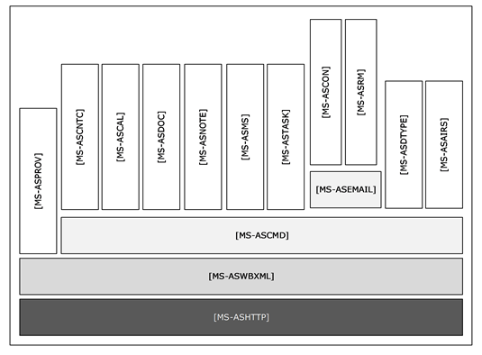

<html dir="LTR" xmlns:mshelp="http://msdn.microsoft.com/mshelp" xmlns:ddue="http://ddue.schemas.microsoft.com/authoring/2003/5" xmlns:xlink="http://www.w3.org/1999/xlink" xmlns:tool="http://www.microsoft.com/tooltip">
    <head>
        <meta http-equiv="Content-Type" content="text/html; CHARSET=utf-8"></meta>
        <meta name="save" content="history"></meta>
        <title>2.2.4 Exchange ActiveSync Protocols</title>
        <xml>
            <mshelp:toctitle title="2.2.4 Exchange ActiveSync Protocols"></mshelp:toctitle>
            <mshelp:rltitle title="[MS-OXPROTO]: Exchange ActiveSync Protocols"></mshelp:rltitle>
            <mshelp:keyword index="A" term="8b83944d-0eed-4b2b-87dd-1982733ec089"></mshelp:keyword>
            <mshelp:attr name="DCSext.ContentType" value="open specification"></mshelp:attr>
            <mshelp:attr name="AssetID" value="8b83944d-0eed-4b2b-87dd-1982733ec089"></mshelp:attr>
            <mshelp:attr name="TopicType" value="kbRef"></mshelp:attr>
            <mshelp:attr name="DCSext.Title" value="[MS-OXPROTO]: Exchange ActiveSync Protocols" />
        </xml>
    </head>
    <body>
        

            <h1 class="heading">2.2.4 Exchange ActiveSync Protocols</h1>
        

        

            

                

                

                    

Exchange ActiveSync protocols enable data to be shared and
synchronized between a server and a mobile client device. The Exchange
ActiveSync protocols also provide a notification mechanism that allows clients
to synchronize updates when changes occur on the server; for example, when a
new e-mail message arrives The hierarchical relationships between the Exchange
ActiveSync protocols are illustrated in the following figure, in which each
protocol is represented by its specification short name.

<b>Figure 4: Exchange ActiveSync specifications</b>

The Exchange ActiveSync protocols are listed in the
following table.

<table>
 <thead>
  <tr>
   <th>
   
Protocol or other technology name

   </th>
   <th>
   
Description

   </th>
   <th>
   
Short name

   </th>
  </tr>
 </thead>
 <tr>
  <td>
  
Exchange ActiveSync: AirSyncBase Namespace Protocol

  </td>
  <td>
  
Used by the Exchange ActiveSync commands to identify
  the size, type, and content of the data sent by and returned to the client. 

  </td>
  <td>
  
<mshelp:link keywords="d1ba7987-41bf-483d-9045-96dfe11e3d1c" tabindex="0">[MS-ASAIRS]</mshelp:link>

  </td>
 </tr>
 <tr>
  <td>
  
Exchange ActiveSync: Calendar Class Protocol

  </td>
  <td>
  
Enables the interchange of calendar data between a
  server and a client device.

  </td>
  <td>
  
<mshelp:link keywords="0c448682-4a6a-459a-ae66-2fed0712bef9" tabindex="0">[MS-ASCAL]</mshelp:link>

  </td>
 </tr>
 <tr>
  <td>
  
Exchange ActiveSync: Command Reference Protocol

  </td>
  <td>
  
Enables the synchronization of e-mail, <a href="f888c37a-d994-4b91-96a5-e88cfbd66bd6.htm#gt_b9d83a03-4998-46ee-9afd-bca72f63af9a">Short Message Service (SMS)</a>
  messages, attachments, folders, <a href="f888c37a-d994-4b91-96a5-e88cfbd66bd6.htm#gt_48d3e923-3081-4b1c-a8b4-db07cc022128">contact (2)</a> information,
  meetings, calendar data, tasks, notes, and documents.

  </td>
  <td>
  
<mshelp:link keywords="1a3490f1-afe1-418a-aa92-6f630036d65a" tabindex="0">[MS-ASCMD]</mshelp:link>

  </td>
 </tr>
 <tr>
  <td>
  
Exchange ActiveSync: Contact Class Protocol

  </td>
  <td>
  
Enables the interchange of contact (1) data between a
  server and a client device.

  </td>
  <td>
  
<mshelp:link keywords="a4593b9d-d9af-4d27-bc5c-67c4c1b98d54" tabindex="0">[MS-ASCNTC]</mshelp:link>

  </td>
 </tr>
 <tr>
  <td>
  
Exchange ActiveSync: Conversations Protocol

  </td>
  <td>
  
Improves the ways in which e-mails are displayed in
  the conversation view.

  </td>
  <td>
  
<mshelp:link keywords="8571bf98-5f7b-4c2f-ab28-c32176d20169" tabindex="0">[MS-ASCON]</mshelp:link>

  </td>
 </tr>
 <tr>
  <td>
  
Exchange ActiveSync: Document Class Protocol

  </td>
  <td>
  
Communicates document data from the server to the
  client. 

  </td>
  <td>
  
<mshelp:link keywords="c503701c-0e59-4beb-9b8b-038cd69a3443" tabindex="0">[MS-ASDOC]</mshelp:link>

  </td>
 </tr>
 <tr>
  <td>
  
Exchange ActiveSync: Data Types

  </td>
  <td>
  
Data types used by the Exchange ActiveSync <a href="f888c37a-d994-4b91-96a5-e88cfbd66bd6.htm#gt_c7e91c99-e45a-44c2-a08a-c34f137a2cae">XML schema definitions (XSDs)</a>.

  </td>
  <td>
  
<mshelp:link keywords="dcfe20e1-cb36-457f-8c7b-e5c61351f7d3" tabindex="0">[MS-ASDTYPE]</mshelp:link>

  </td>
 </tr>
 <tr>
  <td>
  
Exchange ActiveSync: Email Class Protocol

  </td>
  <td>
  
An XML representation of e-mail data sent or received
  on mobile devices that communicate by using the Exchange ActiveSync
  protocols.

  </td>
  <td>
  
<mshelp:link keywords="f3d27369-e0f5-4164-aa5e-9b1abda16f5f" tabindex="0">[MS-ASEMAIL]</mshelp:link>

  </td>
 </tr>
 <tr>
  <td>
  
Exchange ActiveSync: HTTP Protocol

  </td>
  <td>
  
Enables a client device to synchronize data with the
  data that is stored on the server. 

  </td>
  <td>
  
<mshelp:link keywords="4cbf28dc-2876-41c6-9d87-ba9db86cd40d" tabindex="0">[MS-ASHTTP]</mshelp:link>

  </td>
 </tr>
 <tr>
  <td>
  
Exchange ActiveSync: Short Message Service (SMS)
  Protocol

  </td>
  <td>
  
Provides the mechanisms for a mobile device to
  synchronize SMS messages with the server and for the server to send SMS
  messages through the mobile device.

  </td>
  <td>
  
<mshelp:link keywords="3123f34a-aabe-4ec5-aa83-6f6d48698a8b" tabindex="0">[MS-ASMS]</mshelp:link>

  </td>
 </tr>
 <tr>
  <td>
  
Exchange ActiveSync: Notes Class Protocol

  </td>
  <td>
  
Provides the mechanisms that allow a mobile client to
  synchronize user notes with a server.

  </td>
  <td>
  
<mshelp:link keywords="21801d6c-000e-413c-8591-50430a8e9fd9" tabindex="0">[MS-ASNOTE]</mshelp:link>

  </td>
 </tr>
 <tr>
  <td>
  
Exchange ActiveSync: Provisioning Protocol

  </td>
  <td>
  
Enables servers to communicate security policy
  settings to client devices. 

  </td>
  <td>
  
<mshelp:link keywords="449c453b-74d7-4919-bfe8-95972b27048a" tabindex="0">[MS-ASPROV]</mshelp:link>

  </td>
 </tr>
 <tr>
  <td>
  
Exchange ActiveSync: Rights Management Protocol

  </td>
  <td>
  
Describes the actions allowed on an e-mail message and
  its attachments.

  </td>
  <td>
  
<mshelp:link keywords="71e681b7-e178-4c10-96b6-78df7fa77dfc" tabindex="0">[MS-ASRM]</mshelp:link>

  </td>
 </tr>
 <tr>
  <td>
  
Exchange ActiveSync: Tasks Class Protocol

  </td>
  <td>
  
Enables the interchange of task data between a client
  and a server.

  </td>
  <td>
  
<mshelp:link keywords="b8fe2664-50ba-4d00-bf6b-e4deab352c89" tabindex="0">[MS-ASTASK]</mshelp:link>

  </td>
 </tr>
 <tr>
  <td>
  
Exchange ActiveSync: WAP Binary XML (WBXML) Algorithm

  </td>
  <td>
  
Enables <a href="f888c37a-d994-4b91-96a5-e88cfbd66bd6.htm#gt_46afe83a-7afd-42b3-8e27-07b6ae8d3dbc">Wireless Application Protocol
  (WAP) Binary XML (WBXML)</a> encoding.

  </td>
  <td>
  
<mshelp:link keywords="39973eb1-1e40-4eb5-ac74-42781c5a33bc" tabindex="0">[MS-ASWBXML]</mshelp:link>

  </td>
 </tr>
</table>

 

                

            

        

    </body>
</html>