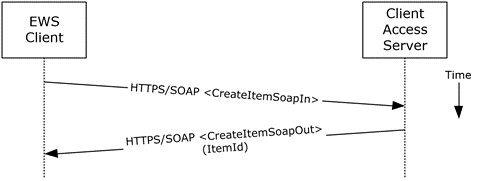

<html dir="LTR" xmlns:mshelp="http://msdn.microsoft.com/mshelp" xmlns:ddue="http://ddue.schemas.microsoft.com/authoring/2003/5" xmlns:xlink="http://www.w3.org/1999/xlink" xmlns:tool="http://www.microsoft.com/tooltip">
    <head>
        <meta http-equiv="Content-Type" content="text/html; CHARSET=utf-8"></meta>
        <meta name="save" content="history"></meta>
        <title>2.5.3.5 Protocol-Specific Details</title>
        <xml>
            <mshelp:toctitle title="2.5.3.5 Protocol-Specific Details"></mshelp:toctitle>
            <mshelp:rltitle title="[MS-OXPROTO]: Protocol-Specific Details"></mshelp:rltitle>
            <mshelp:keyword index="A" term="995b1f0e-a9fe-4ab5-8351-e431f96fbe23"></mshelp:keyword>
            <mshelp:attr name="DCSext.ContentType" value="open specification"></mshelp:attr>
            <mshelp:attr name="AssetID" value="995b1f0e-a9fe-4ab5-8351-e431f96fbe23"></mshelp:attr>
            <mshelp:attr name="TopicType" value="kbRef"></mshelp:attr>
            <mshelp:attr name="DCSext.Title" value="[MS-OXPROTO]: Protocol-Specific Details" />
        </xml>
    </head>
    <body>
        

            <h1 class="heading">2.5.3.5 Protocol-Specific Details</h1>
        

        

            

                

                

                    

The requests and responses below are separated to facilitate
understanding conceptual communication flow and are for illustration purposes
only. This same convention will be used for the use cases hereinafter.

Using remote operations (ROPs)

<dl>
<dd>

</dd>
<dd>

<b>Figure 9: Creating a message by
using ROPs</b>

</dd></dl>

<b>Note  </b>The <a href="f888c37a-d994-4b91-96a5-e88cfbd66bd6.htm#gt_3369fdd6-36f8-4a62-9cd7-2738ffb5048f">ROPs</a> are sent via <a href="f888c37a-d994-4b91-96a5-e88cfbd66bd6.htm#gt_8a7f6700-8311-45bc-af10-82e10accd331">RPC</a> or MAPI extensions for
HTTP. Several ROPs can be batched into a single request, as described in <mshelp:link keywords="13af6911-27e5-4aa0-bb75-637b02d4f2ef" tabindex="0">[MS-OXCROPS]</mshelp:link>.

<ol><li>
    The client logs
on to a <a href="f888c37a-d994-4b91-96a5-e88cfbd66bd6.htm#gt_d3ad0e15-adc9-4174-bacf-d929b57278b3">mailbox</a> per the
use case described in section <a href="073b1877-3b61-4cbe-bd4e-8e158a1a8795.htm">2.5.2</a>.

</li><li>
    The client
issues a <b>RopCreateMessage</b> ROP request ([MS-OXCROPS] section <mshelp:link keywords="851c790c-2f5b-4334-a43a-5f8709afc450" tabindex="0">2.2.6.2</mshelp:link>)
to the Exchange server referencing the folder.

</li><li>
    The Exchange
server responds with a handle to the message.

</li><li>
    Using the
message object handle returned by the server, as described in [MS-OXCROPS]
section <mshelp:link keywords="804fb8cc-a835-45bd-9466-b7f70892f066" tabindex="0">2.2.6.2.2</mshelp:link>,
the client issues a <b>RopSaveChangesMessage</b> ROP request ([MS-OXCROPS]
section <mshelp:link keywords="1ea61240-513a-4367-bc09-cbb21ed82999" tabindex="0">2.2.6.3</mshelp:link>)
to the server to persist the message to storage.

</li><li>
    The server
returns the MID for the new message.

</li></ol>
Using Exchange ActiveSync

<dl>
<dd>

</dd>
<dd>

<b>Figure 10: Creating a message by
using Exchange ActiveSync</b>

</dd></dl>

<ol><li>
    The client uses
the <b>Sync </b>command request (<mshelp:link keywords="1a3490f1-afe1-418a-aa92-6f630036d65a" tabindex="0">[MS-ASCMD]</mshelp:link>
section <mshelp:link keywords="89449dc4-678c-4deb-9be2-e1dbbc43e2f5" tabindex="0">2.2.1.21</mshelp:link>) with an <b>Add</b> element, as described in
[MS-ASCMD] section <mshelp:link keywords="22628ffe-b14a-4300-aec7-187b0c37a1dc" tabindex="0">2.2.3.7.2</mshelp:link>,
to upload/create new application data on the server. An <b>ApplicationData</b>
element, as described in [MS-ASCMD] section <mshelp:link keywords="731a32ef-864d-4fd7-a227-8ee77e3cd9f8" tabindex="0">2.2.3.11</mshelp:link>,
with class &quot;E-mail&quot; needs to contain the required XML schema
elements, as described in <mshelp:link keywords="f3d27369-e0f5-4164-aa5e-9b1abda16f5f" tabindex="0">[MS-ASEMAIL]</mshelp:link>.

</li><li>
    The Exchange
server responds with HTTP status code 200 (OK).

</li></ol>
Using Exchange Web Services

<dl>
<dd>

</dd>
<dd>

<b>Figure 11: Creating a message by
using Exchange Web Services</b>

</dd></dl>

<ol><li>
    The client uses
the HTTPS/SOAP <b>CreateItemSoapIn</b> request <a href="f888c37a-d994-4b91-96a5-e88cfbd66bd6.htm#gt_d5ccdf11-3f53-4118-a845-dfaca61838fb">WSDL message</a>, as described
in <mshelp:link keywords="74051353-1b3f-4298-95c0-e3a54a8512ca" tabindex="0">[MS-OXWSMSG]</mshelp:link>
section <mshelp:link keywords="6fc4f9b4-ea9b-4fe1-a674-9b9c6e106ebd" tabindex="0">3.1.4.2</mshelp:link>,
to create a new message item in the specified folder.

</li><li>
    The Client
Access server responds with a <b>CreateItemSoapOut</b> response WSDL message,
as described in [MS-OXWSMSG] section 3.1.4.2, which includes the <b>ResponseCode</b>
element, indicating the status of the operation, and the <b>ItemId</b> element,
whose value uniquely identifies the new message.

</li></ol>
                

            

        

    </body>
</html>