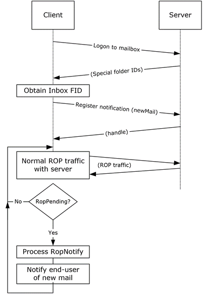

<html dir="LTR" xmlns:mshelp="http://msdn.microsoft.com/mshelp" xmlns:ddue="http://ddue.schemas.microsoft.com/authoring/2003/5" xmlns:xlink="http://www.w3.org/1999/xlink" xmlns:tool="http://www.microsoft.com/tooltip">
    <head>
        <meta http-equiv="Content-Type" content="text/html; CHARSET=utf-8"></meta>
        <meta name="save" content="history"></meta>
        <title>3.3.5 Details</title>
        <xml>
            <mshelp:toctitle title="3.3.5 Details"></mshelp:toctitle>
            <mshelp:rltitle title="[MS-OXPROTO]: Details"></mshelp:rltitle>
            <mshelp:keyword index="A" term="9e59307e-d9f6-41a0-a7fd-34f0e806c01c"></mshelp:keyword>
            <mshelp:attr name="DCSext.ContentType" value="open specification"></mshelp:attr>
            <mshelp:attr name="AssetID" value="9e59307e-d9f6-41a0-a7fd-34f0e806c01c"></mshelp:attr>
            <mshelp:attr name="TopicType" value="kbRef"></mshelp:attr>
            <mshelp:attr name="DCSext.Title" value="[MS-OXPROTO]: Details" />
        </xml>
    </head>
    <body>
        

            <h1 class="heading">3.3.5 Details</h1>
        

        

            

                

                

                    

<dl>
<dd>
<dl>
<dd>

</dd>
<dd>

<b>Figure 41: Setting up and
displaying new mail notifications</b>

</dd></dl></dd></dl>

<ol><li>
    The client logs
on to the <a href="f888c37a-d994-4b91-96a5-e88cfbd66bd6.htm#gt_d3ad0e15-adc9-4174-bacf-d929b57278b3">mailbox</a> per
the use case described in section <a href="073b1877-3b61-4cbe-bd4e-8e158a1a8795.htm">2.5.2</a>.

</li><li>
    The client
obtains the FID for the <a href="f888c37a-d994-4b91-96a5-e88cfbd66bd6.htm#gt_baa08600-0402-47f6-a8ce-9690cf962c96">Inbox
folder</a> from the Exchange server as a result of successful logon.

</li><li>
    The client
registers for notifications for new mail, as described in <mshelp:link keywords="7c7d1653-5dfb-42f1-9410-fc4e48e10731" tabindex="0">[MS-OXCNOTIF]</mshelp:link>,
by referencing the Inbox folder's FID per the use case described in section <a href="d85813a5-373e-4cff-9745-1e345e99b793.htm">2.5.13</a>.

</li><li>
    The client
continuously monitors for <b>RopPending</b> <a href="f888c37a-d994-4b91-96a5-e88cfbd66bd6.htm#gt_3369fdd6-36f8-4a62-9cd7-2738ffb5048f">ROP</a> (<mshelp:link keywords="13af6911-27e5-4aa0-bb75-637b02d4f2ef" tabindex="0">[MS-OXCROPS]</mshelp:link>
section <mshelp:link keywords="c3fdb420-4c92-4b19-a894-f303c50f4a38" tabindex="0">2.2.14.3</mshelp:link>)
result codes from ROP responses as well as <b>RopNotify</b> ROP responses
([MS-OXCROPS] section <mshelp:link keywords="53529946-12bb-4bbc-a969-9878354f239d" tabindex="0">2.2.14.2</mshelp:link>)
in the ROP response payload for notifications. The client will take appropriate
action (for example, play a sound) when a new mail notification is received.

</li></ol>
                

            

        

    </body>
</html>