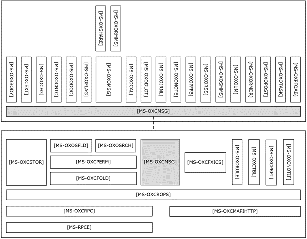

<html dir="LTR" xmlns:mshelp="http://msdn.microsoft.com/mshelp" xmlns:ddue="http://ddue.schemas.microsoft.com/authoring/2003/5" xmlns:xlink="http://www.w3.org/1999/xlink" xmlns:tool="http://www.microsoft.com/tooltip">
    <head>
        <meta http-equiv="Content-Type" content="text/html; CHARSET=utf-8"></meta>
        <meta name="save" content="history"></meta>
        <title>2.2.2 ROP Primer/Storage and Retrieval Protocols</title>
        <xml>
            <mshelp:toctitle title="2.2.2 ROP Primer/Storage and Retrieval Protocols"></mshelp:toctitle>
            <mshelp:rltitle title="[MS-OXPROTO]: ROP Primer/Storage and Retrieval Protocols"></mshelp:rltitle>
            <mshelp:keyword index="A" term="a936a143-4370-4008-8991-86f31f0df4e1"></mshelp:keyword>
            <mshelp:attr name="DCSext.ContentType" value="open specification"></mshelp:attr>
            <mshelp:attr name="AssetID" value="a936a143-4370-4008-8991-86f31f0df4e1"></mshelp:attr>
            <mshelp:attr name="TopicType" value="kbRef"></mshelp:attr>
            <mshelp:attr name="DCSext.Title" value="[MS-OXPROTO]: ROP Primer/Storage and Retrieval Protocols" />
        </xml>
    </head>
    <body>
        

            <h1 class="heading">2.2.2 ROP Primer/Storage and Retrieval Protocols</h1>
        

        

            

                

                

                    

The ROP primer protocols enable the packaging and
transmitting of data between clients and servers. The storage and retrieval
protocols enable the storage and retrieval of messages related to calendars,
tasks, and personal <a href="f888c37a-d994-4b91-96a5-e88cfbd66bd6.htm#gt_48d3e923-3081-4b1c-a8b4-db07cc022128">contacts
(2)</a>. The hierarchical relationships between the ROP storage and retrieval
protocols are illustrated in the following figure, in which each protocol is
represented by its specification short name.

<b>Figure 3: ROP primer/storage and retrieval protocols </b>

                

            

        

    </body>
</html>