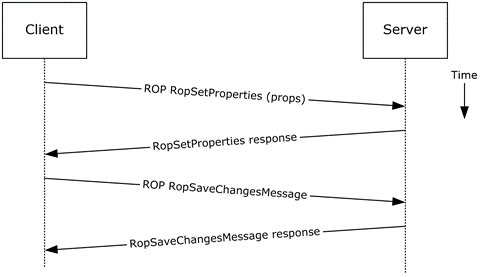
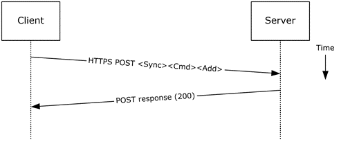
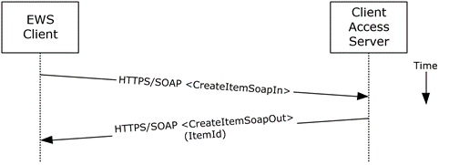

<html dir="LTR" xmlns:mshelp="http://msdn.microsoft.com/mshelp" xmlns:ddue="http://ddue.schemas.microsoft.com/authoring/2003/5" xmlns:xlink="http://www.w3.org/1999/xlink" xmlns:tool="http://www.microsoft.com/tooltip">
    <head>
        <meta http-equiv="Content-Type" content="text/html; CHARSET=utf-8"></meta>
        <meta name="save" content="history"></meta>
        <title>2.5.4.5 Protocol-Specific Details</title>
        <xml>
            <mshelp:toctitle title="2.5.4.5 Protocol-Specific Details"></mshelp:toctitle>
            <mshelp:rltitle title="[MS-OXPROTO]: Protocol-Specific Details"></mshelp:rltitle>
            <mshelp:keyword index="A" term="ad767a88-642c-4baf-afad-eaf4277c19dc"></mshelp:keyword>
            <mshelp:attr name="DCSext.ContentType" value="open specification"></mshelp:attr>
            <mshelp:attr name="AssetID" value="ad767a88-642c-4baf-afad-eaf4277c19dc"></mshelp:attr>
            <mshelp:attr name="TopicType" value="kbRef"></mshelp:attr>
            <mshelp:attr name="DCSext.Title" value="[MS-OXPROTO]: Protocol-Specific Details" />
        </xml>
    </head>
    <body>
        

            <h1 class="heading">2.5.4.5 Protocol-Specific Details</h1>
        

        

            

                

                

                    

Using remote operations (<a href="f888c37a-d994-4b91-96a5-e88cfbd66bd6.htm#gt_3369fdd6-36f8-4a62-9cd7-2738ffb5048f">ROPs</a>)

<dl>
<dd>
<dl>
<dd>

</dd></dl></dd>
<dd>

<b>Figure 12: Creating a strongly
typed message by using ROPs</b>

</dd></dl>

<b>Note  </b>The ROPs are sent via <a href="f888c37a-d994-4b91-96a5-e88cfbd66bd6.htm#gt_8a7f6700-8311-45bc-af10-82e10accd331">RPC</a> or MAPI extensions for
HTTP. Several ROPs can be batched into a single request, as described in <mshelp:link keywords="13af6911-27e5-4aa0-bb75-637b02d4f2ef" tabindex="0">[MS-OXCROPS]</mshelp:link>.

<ol><li>
    The client
creates a message per the use case described in section <a href="9f011f97-a468-422c-a65d-0df484b07106.htm">2.5.3</a>.

</li><li>
    The client
prepares a list of property-value pairs that will be set on the message. The
property-value pairs include the message <a href="f888c37a-d994-4b91-96a5-e88cfbd66bd6.htm#gt_18393bbe-0c06-42b7-890d-b94a9a40b6e0">class</a> and the required
properties associated with the specific message class value.

</li><li>
    The client
issues a <b>RopSetProperties</b> ROP request ([MS-OXCROPS] section <mshelp:link keywords="c7b3e546-4f5e-4fe6-a932-8734c5f2369d" tabindex="0">2.2.8.6</mshelp:link>)
to the Exchange server to set the property-value pairs on the message.

</li><li>
    The Exchange
server returns success or failure of the operation.

</li><li>
    The client
issues a <b>RopSaveChangesMessage</b> ROP request ([MS-OXCROPS] section <mshelp:link keywords="1ea61240-513a-4367-bc09-cbb21ed82999" tabindex="0">2.2.6.3</mshelp:link>)
to the Exchange server to persist the changes.

</li><li>
    The Exchange
server returns success or failure of the save operation. This operation can
fail when any of the required properties associated with the selected message
class are not present.

</li></ol>
Using Exchange ActiveSync

<dl>
<dd>
<dl>
<dd>

</dd>
<dd>

<b>Figure 13: Creating a strongly
typed message by using Exchange ActiveSync</b>

</dd></dl></dd></dl>

<ol><li>
    The client
creates a new message per the use case described in section 2.5.3.

</li><li>
    The client
prepares a list of XML schema item-value pairs to be set on the message. The
item-value pairs include the XML schema class name that corresponds to the kind
of strongly typed message that is desired and the required items associated
with the specific schema class.

</li><li>
    The client uses
the <b>Sync</b> command request (<mshelp:link keywords="1a3490f1-afe1-418a-aa92-6f630036d65a" tabindex="0">[MS-ASCMD]</mshelp:link>
section <mshelp:link keywords="89449dc4-678c-4deb-9be2-e1dbbc43e2f5" tabindex="0">2.2.1.21</mshelp:link>)
with an <b>Add</b> element, as described in [MS-ASCMD] section <mshelp:link keywords="22628ffe-b14a-4300-aec7-187b0c37a1dc" tabindex="0">2.2.3.7.2</mshelp:link>,
to add the required schema items to the message.

</li><li>
    The Exchange
server responds with HTTP status code 200 (OK).

</li></ol>
Using Exchange Web Services

<dl>
<dd>
<dl>
<dd>

</dd>
<dd>

<b>Figure 14: Creating a strongly
typed message by using Exchange Web Services</b>

</dd></dl></dd></dl>

<ol><li>
    The client uses
the HTTPS/SOAP <b>CreateItemSoapIn</b> request <a href="f888c37a-d994-4b91-96a5-e88cfbd66bd6.htm#gt_d5ccdf11-3f53-4118-a845-dfaca61838fb">WSDL message</a>, as described in 
<mshelp:link keywords="74051353-1b3f-4298-95c0-e3a54a8512ca" tabindex="0">[MS-OXWSMSG]</mshelp:link>
section <mshelp:link keywords="6fc4f9b4-ea9b-4fe1-a674-9b9c6e106ebd" tabindex="0">3.1.4.2</mshelp:link>,
to create a new message item in the specified folder. The <b>Message</b>
element contains the properties and child elements that specify the message
class and the required properties associated with the specified message class.

</li><li>
    The Client
Access server responds with a <b>CreateItemSoapOut</b> response WSDL message,
as described in [MS-OXWSMSG] section 3.1.4.2, which includes a <b>ResponseCode</b>
element specifying the status of the operation and an <b>ItemId</b> element
whose value uniquely identifies the new message.

</li></ol>
                

            

        

    </body>
</html>