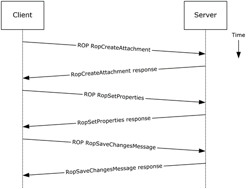
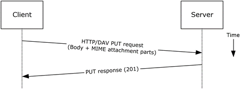
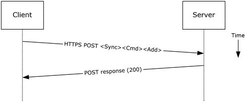
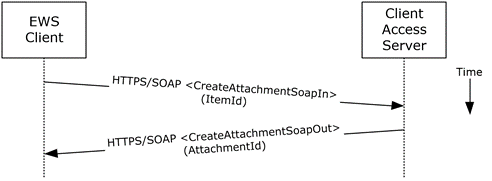

<html dir="LTR" xmlns:mshelp="http://msdn.microsoft.com/mshelp" xmlns:ddue="http://ddue.schemas.microsoft.com/authoring/2003/5" xmlns:xlink="http://www.w3.org/1999/xlink" xmlns:tool="http://www.microsoft.com/tooltip">
    <head>
        <meta http-equiv="Content-Type" content="text/html; CHARSET=utf-8"></meta>
        <meta name="save" content="history"></meta>
        <title>2.5.5.5 Protocol-Specific Details</title>
        <xml>
            <mshelp:toctitle title="2.5.5.5 Protocol-Specific Details"></mshelp:toctitle>
            <mshelp:rltitle title="[MS-OXPROTO]: Protocol-Specific Details"></mshelp:rltitle>
            <mshelp:keyword index="A" term="afdfb661-95df-4cf4-8156-4426bcc21300"></mshelp:keyword>
            <mshelp:attr name="DCSext.ContentType" value="open specification"></mshelp:attr>
            <mshelp:attr name="AssetID" value="afdfb661-95df-4cf4-8156-4426bcc21300"></mshelp:attr>
            <mshelp:attr name="TopicType" value="kbRef"></mshelp:attr>
            <mshelp:attr name="DCSext.Title" value="[MS-OXPROTO]: Protocol-Specific Details" />
        </xml>
    </head>
    <body>
        

            <h1 class="heading">2.5.5.5 Protocol-Specific Details</h1>
        

        

            

                

                

                    

Using remote procedures (ROPs)

<dl>
<dd>
<dl>
<dd>

</dd>
<dd>

<b>Figure 15: Adding an attachment by
using ROPs</b>

</dd></dl></dd></dl>

<b>Note  </b>The <a href="f888c37a-d994-4b91-96a5-e88cfbd66bd6.htm#gt_3369fdd6-36f8-4a62-9cd7-2738ffb5048f">ROPs</a> are sent via <a href="f888c37a-d994-4b91-96a5-e88cfbd66bd6.htm#gt_8a7f6700-8311-45bc-af10-82e10accd331">RPC</a> or MAPI extensions for
HTTP. Several ROPs can be batched into a single request, as described in <mshelp:link keywords="13af6911-27e5-4aa0-bb75-637b02d4f2ef" tabindex="0">[MS-OXCROPS]</mshelp:link>.

<ol><li>
    The client
creates a message per the use case described in section <a href="9f011f97-a468-422c-a65d-0df484b07106.htm">2.5.3</a>.

</li><li>
    The client
issues a <b>RopCreateAttachment</b> ROP request ([MS-OXCROPS] section <mshelp:link keywords="c006dc86-1e0d-46e2-96ac-82856228357a" tabindex="0">2.2.6.13</mshelp:link>)
to the Exchange server to create a new attachment associated with the message.

</li><li>
    Upon success,
the Exchange server returns a handle to the attachment.

</li><li>
    The client
prepares a list of required and optional property-value pairs to be set on the
attachment. The attachment data is also set as one of the property values.

</li><li>
    The client
issues a <b>RopSetProperties</b> ROP request ([MS-OXCROPS] section <mshelp:link keywords="c7b3e546-4f5e-4fe6-a932-8734c5f2369d" tabindex="0">2.2.8.6</mshelp:link>)
to the Exchange server to set the list of property-value pairs on the message.

</li><li>
    The Exchange
server returns the success or failure of the operation.

</li><li>
    Using the
attachment handle, the client issues a <b>RopSaveChangesMessage</b> ROP
([MS-OXCROPS] section <mshelp:link keywords="1ea61240-513a-4367-bc09-cbb21ed82999" tabindex="0">2.2.6.3</mshelp:link>)
attachment request to the Exchange server to persist the new attachment.

</li><li>
    The Exchange
server responds with HTTP status code 200 (OK). This operation can fail when
any of the required properties for an attachment are not present.

</li></ol>
Using <a href="f888c37a-d994-4b91-96a5-e88cfbd66bd6.htm#gt_68024ef0-c00a-4ecf-8dba-42371b11bfeb">WebDAV</a>

<dl>
<dd>
<dl>
<dd>

</dd>
<dd>

<b>Figure 16: Adding an attachment by
using WebDAV</b>

</dd></dl></dd></dl>

<ol><li>
    The client
creates a new message per the use case described in section 2.5.3.

</li><li>
    The client uses
the HTTP <b>PUT</b> request, as described in <a href="https://go.microsoft.com/fwlink/?LinkId=90310">[RFC2068]</a>, to replace
the existing message document resource, specifying a new <a href="f888c37a-d994-4b91-96a5-e88cfbd66bd6.htm#gt_f8f4c2f5-c760-4abe-a9a1-573302980088">message body (1)</a> that
contains the attachment data as embedded <a href="f888c37a-d994-4b91-96a5-e88cfbd66bd6.htm#gt_af6ba277-34c1-493d-8103-71d2af36ce30">MIME</a> body parts.

</li><li>
    The Exchange
server responds as described in [RFC2068] and Exchange-specific WebDAV
extensions.

</li></ol>
Using Exchange ActiveSync

<dl>
<dd>
<dl>
<dd>

</dd>
<dd>

<b>Figure 17: Adding an attachment by
using Exchange ActiveSync</b>

</dd></dl></dd></dl>

<ol><li>
    The client
creates a new message per the use case described in section 2.5.3.

</li><li>
    The client uses
the <b>Sync </b>command request (<mshelp:link keywords="1a3490f1-afe1-418a-aa92-6f630036d65a" tabindex="0">[MS-ASCMD]</mshelp:link>
section <mshelp:link keywords="89449dc4-678c-4deb-9be2-e1dbbc43e2f5" tabindex="0">2.2.1.21</mshelp:link>),
with an Add element, as described in [MS-ASCMD] section <mshelp:link keywords="22628ffe-b14a-4300-aec7-187b0c37a1dc" tabindex="0">2.2.3.7.2</mshelp:link>,
to upload/create new ApplicationData of class &quot;Attachment&quot; on the
server. The attachment is added to a collection inside the message.

</li><li>
    The Exchange
server responds with HTTP status code 200 (OK) and returns a server ID that
identifies the uploaded attachment.

</li></ol>
Using Exchange Web Services

<dl>
<dd>
<dl>
<dd>

</dd>
<dd>

<b>Figure 18: Adding an attachment by
using Exchange Web Services</b>

</dd></dl></dd></dl>

<ol><li>
    The client
creates a new message item as described in section 2.5.3 and notes the value of
the <b>ItemId</b> element for the new message.

</li><li>
    The client uses
the HTTPS/SOAP <b>CreateAttachmentSoapIn</b> request <a href="f888c37a-d994-4b91-96a5-e88cfbd66bd6.htm#gt_d5ccdf11-3f53-4118-a845-dfaca61838fb">WSDL message</a>, as described
in <mshelp:link keywords="cda9147b-dac2-4411-8b01-eb02e61c9e24" tabindex="0">[MS-OXWSATT]</mshelp:link>
section <mshelp:link keywords="ed9cf732-00d8-4494-89d1-bf4c0def0c97" tabindex="0">3.1.4.1.1.1</mshelp:link>,
to create a new attachment. To associate the attachment with the message, the
client includes the <b>ItemId</b> element, which sets the new message as the
attachment's parent item.

</li><li>
    The Client
Access server responds with a <b>CreateAttachmentSoapOut</b> response WSDL
message, as described in [MS-OXWSATT] section <mshelp:link keywords="1c848e9c-eb8a-4a5e-8c96-295b34e6ac65" tabindex="0">3.1.4.1.1.2</mshelp:link>,
which includes the <b>ResponseCode</b> element and the <b>AttachmentId</b>
element, whose value uniquely identifies the new attachment.

</li></ol>
                

            

        

    </body>
</html>