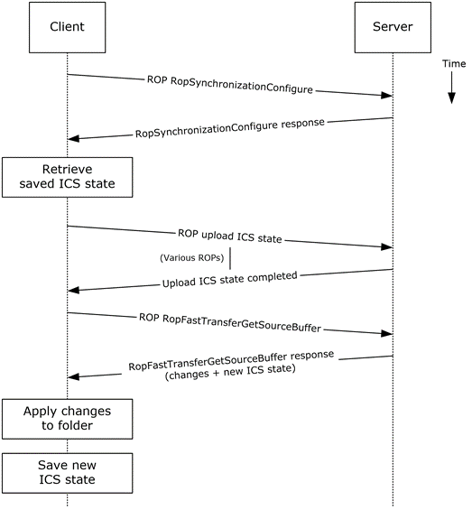
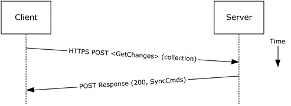
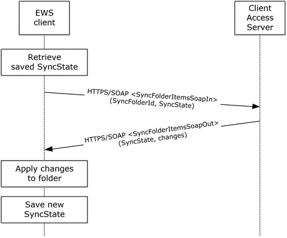

<html dir="LTR" xmlns:mshelp="http://msdn.microsoft.com/mshelp" xmlns:ddue="http://ddue.schemas.microsoft.com/authoring/2003/5" xmlns:xlink="http://www.w3.org/1999/xlink" xmlns:tool="http://www.microsoft.com/tooltip">
    <head>
        <meta http-equiv="Content-Type" content="text/html; CHARSET=utf-8"></meta>
        <meta name="save" content="history"></meta>
        <title>2.5.12.5 Protocol-Specific Details</title>
        <xml>
            <mshelp:toctitle title="2.5.12.5 Protocol-Specific Details"></mshelp:toctitle>
            <mshelp:rltitle title="[MS-OXPROTO]: Protocol-Specific Details"></mshelp:rltitle>
            <mshelp:keyword index="A" term="c4fbd635-72b6-4362-aece-01b380346595"></mshelp:keyword>
            <mshelp:attr name="DCSext.ContentType" value="open specification"></mshelp:attr>
            <mshelp:attr name="AssetID" value="c4fbd635-72b6-4362-aece-01b380346595"></mshelp:attr>
            <mshelp:attr name="TopicType" value="kbRef"></mshelp:attr>
            <mshelp:attr name="DCSext.Title" value="[MS-OXPROTO]: Protocol-Specific Details" />
        </xml>
    </head>
    <body>
        

            <h1 class="heading">2.5.12.5 Protocol-Specific Details</h1>
        

        

            

                

                

                    

Using <a href="f888c37a-d994-4b91-96a5-e88cfbd66bd6.htm#gt_3369fdd6-36f8-4a62-9cd7-2738ffb5048f">remote
operations (ROPs)</a>

<dl>
<dd>
<dl>
<dd>

</dd>
<dd>

<b>Figure 33: Synchronizing items by
using ROPs</b>

</dd></dl></dd></dl>

<b>Note  </b>The ROPs are sent via <a href="f888c37a-d994-4b91-96a5-e88cfbd66bd6.htm#gt_8a7f6700-8311-45bc-af10-82e10accd331">RPC</a> or MAPI extensions for <a href="f888c37a-d994-4b91-96a5-e88cfbd66bd6.htm#gt_d72f1494-4917-4e9e-a9fd-b8f1b2758dcd">HTTP</a>. Several ROPs can be
batched into a single request, as described in <mshelp:link keywords="13af6911-27e5-4aa0-bb75-637b02d4f2ef" tabindex="0">[MS-OXCROPS]</mshelp:link>.

<ol><li>
    The client opens
the specified folder per the use case described in section <a href="c17348f9-48a3-48ca-a6d7-783f26af9159.htm">2.5.9</a>.

</li><li>
    The client
issues a <b>RopSynchronizationConfigure</b> ROP request ([MS-OXCROPS] section <mshelp:link keywords="24693f6e-7a72-4f55-9708-61d1d3315587" tabindex="0">2.2.13.1</mshelp:link>)
by using the handle to the folder to initiate the synchronization.

</li><li>
    The Exchange
server responds with a handle to the synchronization.

</li><li>
    The client uses
a series of <b>RopSynchronizationUploadStateStreamBegin </b>([MS-OXCROPS]
section <mshelp:link keywords="60c03537-2a4e-4e12-8600-79bec3ec024a" tabindex="0">2.2.13.9</mshelp:link>),
<b>RopSynchronizationUploadStateStreamContinue </b>([MS-OXCROPS] section <mshelp:link keywords="61d3abc8-3d8e-4c66-8502-452e8236010e" tabindex="0">2.2.13.10</mshelp:link>),
and <b>RopSynchronizationUploadStateStreamEnd </b>([MS-OXCROPS] section <mshelp:link keywords="d2efd8c8-720e-4f9a-a16a-e2a0b4ea88d2" tabindex="0">2.2.13.11</mshelp:link>)
ROP requests to upload the client's <a href="f888c37a-d994-4b91-96a5-e88cfbd66bd6.htm#gt_8ba679a1-85f9-4a19-8543-ef83bd8f2e4b">Incremental Change
Synchronization (ICS)</a> state, as described in <mshelp:link keywords="b9752f3d-d50d-44b8-9e6b-608a117c8532" tabindex="0">[MS-OXCFXICS]</mshelp:link>,
to the Exchange server, which prepares the list of changed items for the client
to download based on the uploaded <a href="f888c37a-d994-4b91-96a5-e88cfbd66bd6.htm#gt_3b15ed8e-d282-4a5f-a730-c202a23b73b5">ICS state</a>.

</li><li>
    The client
issues a <b>RopFastTransferSourceGetBuffer</b> ROP request ([MS-OXCROPS]
section <mshelp:link keywords="d92f5444-8711-42d2-8471-33625b32562a" tabindex="0">2.2.12.4</mshelp:link>)
to obtain the list of changes from the Exchange server.

</li><li>
    The Exchange
server responds to the request with the full list of changes as well as the new
ICS state.

</li><li>
    The client
applies the changes to the folder items and saves the new ICS state for
subsequent synchronizations.

</li></ol>
Using Exchange ActiveSync

<dl>
<dd>
<dl>
<dd>

</dd>
<dd>

<b>Figure 34: Synchronizing items by
using Exchange ActiveSync</b>

</dd></dl></dd></dl>

<ol><li>
    The client
issues a <b>Sync</b> command request, as described in <mshelp:link keywords="1a3490f1-afe1-418a-aa92-6f630036d65a" tabindex="0">[MS-ASCMD]</mshelp:link>
section <mshelp:link keywords="89449dc4-678c-4deb-9be2-e1dbbc43e2f5" tabindex="0">2.2.1.21</mshelp:link>,
with a <b>GetChanges</b> element, as described in [MS-ASCMD] section <mshelp:link keywords="033361d1-1f2e-4338-b537-66658aa6a62a" tabindex="0">2.2.3.84</mshelp:link>,
to the Exchange server requesting a list of all changes that have occurred in
the specified collection (folder) since the last successful synchronization.

</li><li>
    The Exchange
server responds with a series of <b>Sync</b> command responses, as described in
[MS-ASCMD] section 2.2.1.21, that the client processes to synchronize with the
Exchange server.

</li></ol>
Using Exchange Web Services

<dl>
<dd>
<dl>
<dd>

</dd>
<dd>

<b>Figure 35: Synchronizing items by
using Exchange Web Services</b>

</dd></dl></dd></dl>

<ol><li>
    The client uses
the HTTPS/SOAP <b>SyncFolderItemsSoapIn</b> request message, as described in <mshelp:link keywords="9ac26095-b7fc-430e-94cf-0dc34b9a09a0" tabindex="0">[MS-OXWSSYNC]</mshelp:link>
section <mshelp:link keywords="42e80965-d33e-42cd-93a0-5447317cfe2b" tabindex="0">3.1.4.2.1.1</mshelp:link>,
to synchronize the changes to items in the folder specified in the <b>SyncFolderId</b>
element. The <b>SyncState</b> element provides the state of the last
synchronization and acts as a starting marker for synchronizing new changes.

</li><li>
    The Exchange
Client Access server responds with a <b>SyncFolderItemsSoapOut</b> response
message, as described in [MS-OXWSSYNC] section <mshelp:link keywords="19e5ae62-e359-42ff-97af-dd41b1719704" tabindex="0">3.1.4.2.1.2</mshelp:link>,
which includes a <b>ResponseCode</b> element, a new <b>SyncState</b> marker,
and a list of changes.

</li><li>
    The client
applies changes to the folder by using information in the <b>SyncFolderItemsSoapOut</b>
response, and saves the <b>SyncState</b> value that was returned in the <b>SyncFolderItemsSoapOut</b>
response.

</li></ol>
                

            

        

    </body>
</html>