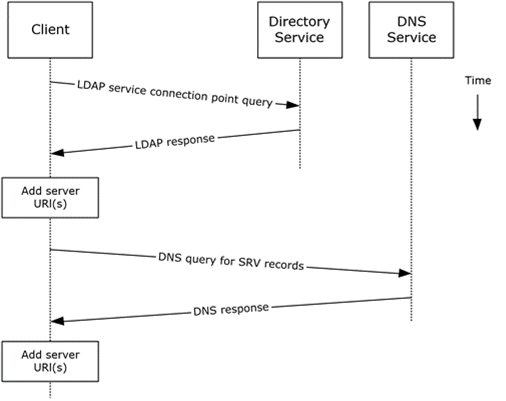

<html dir="LTR" xmlns:mshelp="http://msdn.microsoft.com/mshelp" xmlns:ddue="http://ddue.schemas.microsoft.com/authoring/2003/5" xmlns:xlink="http://www.w3.org/1999/xlink" xmlns:tool="http://www.microsoft.com/tooltip">
    <head>
        <meta http-equiv="Content-Type" content="text/html; CHARSET=utf-8"></meta>
        <meta name="save" content="history"></meta>
        <title>2.5.1.5 Protocol-Specific Details</title>
        <xml>
            <mshelp:toctitle title="2.5.1.5 Protocol-Specific Details"></mshelp:toctitle>
            <mshelp:rltitle title="[MS-OXPROTO]: Protocol-Specific Details"></mshelp:rltitle>
            <mshelp:keyword index="A" term="d90cc30a-bdb7-43f0-81ec-d76a873f256f"></mshelp:keyword>
            <mshelp:attr name="DCSext.ContentType" value="open specification"></mshelp:attr>
            <mshelp:attr name="AssetID" value="d90cc30a-bdb7-43f0-81ec-d76a873f256f"></mshelp:attr>
            <mshelp:attr name="TopicType" value="kbRef"></mshelp:attr>
            <mshelp:attr name="DCSext.Title" value="[MS-OXPROTO]: Protocol-Specific Details" />
        </xml>
    </head>
    <body>
        

            <h1 class="heading">2.5.1.5 Protocol-Specific Details</h1>
        

        

            

                

                

                    

Using <a href="f888c37a-d994-4b91-96a5-e88cfbd66bd6.htm#gt_45643bfb-b4c4-432c-a10f-b98790063f8d">LDAP</a>
and <a href="f888c37a-d994-4b91-96a5-e88cfbd66bd6.htm#gt_604dcfcd-72f5-46e5-85c1-f3ce69956700">DNS</a> protocols.

<dl>
<dd>
<dl>
<dd>

</dd>
<dd>

<b>Figure 6: Server information discovery
by using LDAP and DNS</b>

</dd></dl></dd></dl>

<ol><li>
    The client
contacts an LDAP server <a href="f888c37a-d994-4b91-96a5-e88cfbd66bd6.htm#gt_c36db657-3138-4d9a-9289-ded5cbb8b40e">DS</a>
for <a href="f888c37a-d994-4b91-96a5-e88cfbd66bd6.htm#gt_4c6364db-d5de-4700-8d59-a49d4b53cdb2">service connection point</a>
objects via LDAP. 

</li><li>
    The LDAP server returns
one or more service connection point objects, which reference one or more
Autodiscover server URIs or another LDAP server. If the service connection
point returns another LDAP server, repeat step 1 with the new LDAP server until
URIs are returned for Autodiscover servers.

</li><li>
    The client
parses the <a href="f888c37a-d994-4b91-96a5-e88cfbd66bd6.htm#gt_e18af8e8-01d7-4f91-8a1e-0fb21b191f95">URI</a> and adds
the appropriate Autodiscover server URIs to the list of possible Autodiscover
server URIs.

</li><li>
    The client
executes a DNS search for SRV records that match the returned Autodiscover
server URI.

</li><li>
    If the DNS
server responds with any SRV records, the corresponding Autodiscover server URI
records are added to the list of possible Autodiscover server URIs on the
client. It is not an error if the DNS server does not return any DNS SRV
records in response to the DNS search.

</li><li>
    The client uses
the Autodiscover server URI to contact the <a href="f888c37a-d994-4b91-96a5-e88cfbd66bd6.htm#gt_fc6c5200-5f99-459b-85cf-3b7d841979be">Autodiscover server</a> via <a href="f888c37a-d994-4b91-96a5-e88cfbd66bd6.htm#gt_d72f1494-4917-4e9e-a9fd-b8f1b2758dcd">HTTP</a> to query server
information.

</li></ol>
                

            

        

    </body>
</html>