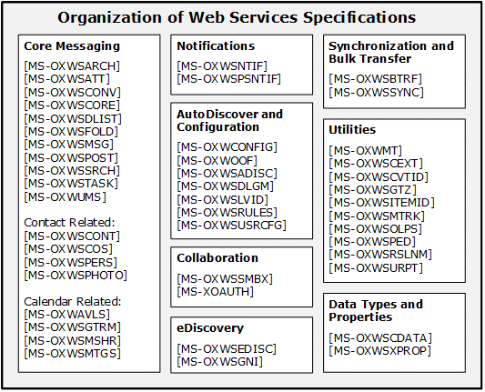

<html dir="LTR" xmlns:mshelp="http://msdn.microsoft.com/mshelp" xmlns:ddue="http://ddue.schemas.microsoft.com/authoring/2003/5" xmlns:xlink="http://www.w3.org/1999/xlink" xmlns:tool="http://www.microsoft.com/tooltip">
    <head>
        <meta http-equiv="Content-Type" content="text/html; CHARSET=utf-8"></meta>
        <meta name="save" content="history"></meta>
        <title>2.2.10 Web Service Protocols</title>
        <xml>
            <mshelp:toctitle title="2.2.10 Web Service Protocols"></mshelp:toctitle>
            <mshelp:rltitle title="[MS-OXPROTO]: Web Service Protocols"></mshelp:rltitle>
            <mshelp:keyword index="A" term="e91d2bc8-687f-4ca2-bc68-2b3854eb5113"></mshelp:keyword>
            <mshelp:attr name="DCSext.ContentType" value="open specification"></mshelp:attr>
            <mshelp:attr name="AssetID" value="e91d2bc8-687f-4ca2-bc68-2b3854eb5113"></mshelp:attr>
            <mshelp:attr name="TopicType" value="kbRef"></mshelp:attr>
            <mshelp:attr name="DCSext.Title" value="[MS-OXPROTO]: Web Service Protocols" />
        </xml>
    </head>
    <body>
        

            <h1 class="heading">2.2.10 Web Service Protocols</h1>
        

        

            

                

                

                    

Web services and HTTP/1.1 provide a standards-based layer
upon which to build specific client-server protocols. Protocols and other
technologies listed in this section are built on client and server
implementations of HTTP/1.1, as specified in <a href="https://go.microsoft.com/fwlink/?LinkId=90372">[RFC2616]</a>. The WS-I
Base Profile 1.0 <a href="https://go.microsoft.com/fwlink/?LinkId=193333">[WSIBASIC]</a>
provides the reference infrastructure for protocols identified as Web Services.

The Web Services specifications can be grouped into
functional areas as illustrated in the following diagram.

<b>Figure 5: Web Services specifications</b>

The Web Services protocols are listed in the following
table.

<table>
 <thead>
  <tr>
   <th>
   
Protocol or other technology name

   </th>
   <th>
   
Description

   </th>
   <th>
   
Short name

   </th>
  </tr>
 </thead>
 <tr>
  <td>
  
Availability Web Service Protocol

  </td>
  <td>
  
Enables clients to request availability information
  for users and/or resources.

  </td>
  <td>
  
<mshelp:link keywords="69a276d8-5fc3-40ba-acd0-31cf42e6af58" tabindex="0">[MS-OXWAVLS]</mshelp:link>

  </td>
 </tr>
 <tr>
  <td>
  
Web Service Configuration Protocol

  </td>
  <td>
  
Enables clients to retrieve organization policy
  configuration information for a <a href="f888c37a-d994-4b91-96a5-e88cfbd66bd6.htm#gt_d3ad0e15-adc9-4174-bacf-d929b57278b3">mailbox</a>. 

  </td>
  <td>
  
<mshelp:link keywords="dbef7bda-576e-47ac-9cb2-46bdd59949ca" tabindex="0">[MS-OXWCONFIG]</mshelp:link>

  </td>
 </tr>
 <tr>
  <td>
  
Mail Tips Web Service Extensions

  </td>
  <td>
  
Extends the Mail Tips Web Service protocol, which
  enables clients to retrieve mail tips for a mailbox.

  </td>
  <td>
  
<mshelp:link keywords="ddc7ae3b-be9f-42eb-80bd-6344e471be50" tabindex="0">[MS-OXWMT]</mshelp:link>

  </td>
 </tr>
 <tr>
  <td>
  
Voice Mail Settings Web Service Protocol

  </td>
  <td>
  
Enables clients to read and change information about
  Unified Messaging properties, play voice mail, or record greetings over the
  telephone.

  </td>
  <td>
  
<mshelp:link keywords="79ace092-b793-4fa5-82b0-dd30d12c14c2" tabindex="0">[MS-OXWUMS]</mshelp:link>

  </td>
 </tr>
 <tr>
  <td>
  
Out of Office (OOF) Web Service Protocol

  </td>
  <td>
  
Enables clients to configure server-based automatic
  e-mail responses.

  </td>
  <td>
  
<mshelp:link keywords="9098f96a-4a94-4935-a6a4-7188117debb5" tabindex="0">[MS-OXWOOF]</mshelp:link>

  </td>
 </tr>
 <tr>
  <td>
  
Autodiscover Publishing and Lookup SOAP-Based Web
  Service Protocol

  </td>
  <td>
  
Enables clients to retrieve user configuration
  settings information.

  </td>
  <td>
  
<mshelp:link keywords="b239dc06-c52c-4259-bc49-1ff88d22ae3c" tabindex="0">[MS-OXWSADISC]</mshelp:link>

  </td>
 </tr>
 <tr>
  <td>
  
Attachment Handling Web Service Protocol

  </td>
  <td>
  
Enables clients to create, delete, and get attachments
  on items on the server.

  </td>
  <td>
  
<mshelp:link keywords="cda9147b-dac2-4411-8b01-eb02e61c9e24" tabindex="0">[MS-OXWSATT]</mshelp:link>

  </td>
 </tr>
 <tr>
  <td>
  
Bulk Transfer Web Service Protocol

  </td>
  <td>
  
Enables the export and upload of streamed item data
  between the server and the client.

  </td>
  <td>
  
<mshelp:link keywords="516f0593-4921-4f3e-9c24-fa642b7d0873" tabindex="0">[MS-OXWSBTRF]</mshelp:link>

  </td>
 </tr>
 <tr>
  <td>
  
Common Web Service Data Types

  </td>
  <td>
  
Describes Web service data types that are used by more
  than one Web service protocol.

  </td>
  <td>
  
<mshelp:link keywords="13890944-4c81-4deb-b95f-6d717e1438cd" tabindex="0">[MS-OXWSCDATA]</mshelp:link>

  </td>
 </tr>
 <tr>
  <td>
  
Contacts Web Service Protocol

  </td>
  <td>
  
Enables clients to create, get, update, delete, move,
  and copy <a href="f888c37a-d994-4b91-96a5-e88cfbd66bd6.htm#gt_48d3e923-3081-4b1c-a8b4-db07cc022128">contact (2)</a>
  items on the server.

  </td>
  <td>
  
<mshelp:link keywords="23558662-75c5-48d3-a8f3-5d59ef5b3683" tabindex="0">[MS-OXWSCONT]</mshelp:link>

  </td>
 </tr>
 <tr>
  <td>
  
Conversations Web Service Protocol

  </td>
  <td>
  
Enables clients to find items in a conversation and
  apply actions to items in a conversation.

  </td>
  <td>
  
<mshelp:link keywords="311bbe7e-56d3-4731-8475-a874c319d0f9" tabindex="0">[MS-OXWSCONV]</mshelp:link>

  </td>
 </tr>
 <tr>
  <td>
  
Core Items Web Service Protocol

  </td>
  <td>
  
Enables clients to create, update, and delete items on
  the server.

  </td>
  <td>
  
<mshelp:link keywords="7a113138-a0db-4168-a164-bf8b05cc4e6d" tabindex="0">[MS-OXWSCORE]</mshelp:link>

  </td>
 </tr>
 <tr>
  <td>
  
Convert Item Identifier Web Service Protocol

  </td>
  <td>
  
Enables clients to convert among the different
  identifier formats that can be used to locate items stored on the server.

  </td>
  <td>
  
<mshelp:link keywords="7e7465ed-30bd-4167-92c4-1f1a82d90224" tabindex="0">[MS-OXWSCVTID]</mshelp:link>

  </td>
 </tr>
 <tr>
  <td>
  
Delegate Access Management Web Service Protocol

  </td>
  <td>
  
Enables clients to manage delegate access to mailbox
  information that is stored on a server.

  </td>
  <td>
  
<mshelp:link keywords="365cb220-56ba-4e2c-a244-b143a1f2eeac" tabindex="0">[MS-OXWSDLGM]</mshelp:link>

  </td>
 </tr>
 <tr>
  <td>
  
Distribution List Creation and Usage Web Service
  Protocol

  </td>
  <td>
  
Enables clients to query the server for distribution
  lists; expand a distribution list into the constituent e-mail addresses; and
  create, delete, get, move, update, and copy distribution lists.

  </td>
  <td>
  
<mshelp:link keywords="ef5920ae-ccb8-4bee-ab85-a950ec7b0009" tabindex="0">[MS-OXWSDLIST]</mshelp:link>

  </td>
 </tr>
 <tr>
  <td>
  
Folders and Folder Permissions Web Service Protocol

  </td>
  <td>
  
Enables clients to create, copy, move, delete, get, or
  empty folders and to modify folder permissions that are stored on the server.
  

  </td>
  <td>
  
<mshelp:link keywords="a6f7e293-183e-47ed-90c1-dc80129229df" tabindex="0">[MS-OXWSFOLD]</mshelp:link>

  </td>
 </tr>
 <tr>
  <td>
  
Get Rooms List Web Service Protocol

  </td>
  <td>
  
Enables clients to retrieve information about meeting
  rooms from the server.

  </td>
  <td>
  
<mshelp:link keywords="46852f67-8163-4569-82f6-5c91c9cf2b72" tabindex="0">[MS-OXWSGTRM]</mshelp:link>

  </td>
 </tr>
 <tr>
  <td>
  
Get Server Time Zone Web Service Protocol

  </td>
  <td>
  
Enables clients to retrieve time zone information that
  is used by the server.

  </td>
  <td>
  
<mshelp:link keywords="acc1f709-7474-4f90-8088-3e93caa189e3" tabindex="0">[MS-OXWSGTZ]</mshelp:link>

  </td>
 </tr>
 <tr>
  <td>
  
Web Service Item ID Algorithm

  </td>
  <td>
  
Describes how to create and process an item
  identifier.

  </td>
  <td>
  
<mshelp:link keywords="d4746001-adcb-4c7f-91f8-c86f07ba5e9b" tabindex="0">[MS-OXWSITEMID]</mshelp:link>
  

  </td>
 </tr>
 <tr>
  <td>
  
Federated Internet Authentication Web Service Protocol

  </td>
  <td>
  
Describes the interaction between the server and
  standard Internet authentication protocols.

  </td>
  <td>
  
<mshelp:link keywords="77ba56de-aa53-40f0-99ed-a9b3c640f0e0" tabindex="0">[MS-OXWSLVID]</mshelp:link>

  </td>
 </tr>
 <tr>
  <td>
  
Email Message Types Web Service Protocol

  </td>
  <td>
  
Enables clients to create, update, and delete e-mail
  items on the server.

  </td>
  <td>
  
<mshelp:link keywords="74051353-1b3f-4298-95c0-e3a54a8512ca" tabindex="0">[MS-OXWSMSG]</mshelp:link>

  </td>
 </tr>
 <tr>
  <td>
  
Folder Sharing Web Service Protocol

  </td>
  <td>
  
Enables clients to manage <a href="f888c37a-d994-4b91-96a5-e88cfbd66bd6.htm#gt_60b55610-ca65-41f2-91d8-a4d6f4cc6d20">Calendar folders</a> that are
  shared between users in separate organizations.

  </td>
  <td>
  
<mshelp:link keywords="f4a422c4-5ad4-4b08-9751-e1b5838213d8" tabindex="0">[MS-OXWSMSHR]</mshelp:link>

  </td>
 </tr>
 <tr>
  <td>
  
Calendaring Web Service Protocol

  </td>
  <td>
  
Enables clients to create, retrieve, update, move,
  copy, and delete calendar-related items (that is, appointments, meetings,
  meeting request messages, meeting response messages, and meeting cancellation
  messages) on the server.

  </td>
  <td>
  
<mshelp:link keywords="ce045e39-07ee-41ed-89b3-7b68983f1a95" tabindex="0">[MS-OXWSMTGS]</mshelp:link>

  </td>
 </tr>
 <tr>
  <td>
  
Message Tracking Web Service Protocol

  </td>
  <td>
  
Enables clients to find and retrieve information about
  message delivery by the server.

  </td>
  <td>
  
<mshelp:link keywords="bf53380f-93bf-46ee-a452-6ab66185cc7f" tabindex="0">[MS-OXWSMTRK]</mshelp:link>

  </td>
 </tr>
 <tr>
  <td>
  
Notifications Web Service Protocol

  </td>
  <td>
  
Enables clients to receive pull notifications from the
  server.

  </td>
  <td>
  
<mshelp:link keywords="fcc4a799-daf0-4fdf-be8f-ae0aa39ae6a9" tabindex="0">[MS-OXWSNTIF]</mshelp:link>

  </td>
 </tr>
 <tr>
  <td>
  
Online Personal Search Web Service Protocol

  </td>
  <td>
  
Enables a client to search a collection of items and
  return information about those items (if any) that match.

  </td>
  <td>
  
<mshelp:link keywords="b8b9ad10-c36e-44e8-b66a-ff69fa2d070c" tabindex="0">[MS-OXWSOLPS]</mshelp:link>

  </td>
 </tr>
 <tr>
  <td>
  
Password Expiration Date Web Service Protocol

  </td>
  <td>
  
Enables client applications to query a server to
  determine when the password for an account will expire so that the
  application can warn that the password needs to be changed.

  </td>
  <td>
  
<mshelp:link keywords="e8325646-66a9-4aea-bac4-4a68e5d6fef8" tabindex="0">[MS-OXWSPED]</mshelp:link>

  </td>
 </tr>
 <tr>
  <td>
  
Post Items Web Service Protocol

  </td>
  <td>
  
Enables clients to create, retrieve, update, move,
  copy, and delete <a href="f888c37a-d994-4b91-96a5-e88cfbd66bd6.htm#gt_60c7297b-b8d5-44f9-9110-34e946d31a85">Post
  objects</a> on the server.

  </td>
  <td>
  
<mshelp:link keywords="daddccba-4de4-4d16-87cf-15bd07282acc" tabindex="0">[MS-OXWSPOST]</mshelp:link>

  </td>
 </tr>
 <tr>
  <td>
  
Push Notifications Web Service Protocol

  </td>
  <td>
  
Enables clients to receive subscribed event updates
  that are sent by the server.

  </td>
  <td>
  
<mshelp:link keywords="dbc436f2-9eca-4dd8-b509-025543cf843f" tabindex="0">[MS-OXWSPSNTIF]</mshelp:link>

  </td>
 </tr>
 <tr>
  <td>
  
Resolve Recipient Names Web Service Protocol

  </td>
  <td>
  
Enables clients with incomplete recipient identifying
  information to retrieve a list of matching and similar recipients that are
  known to the server.

  </td>
  <td>
  
<mshelp:link keywords="0665e7dc-7b68-48d7-83ff-7aa94edbe362" tabindex="0">[MS-OXWSRSLNM]</mshelp:link>

  </td>
 </tr>
 <tr>
  <td>
  
Inbox Rules Web Service Protocol

  </td>
  <td>
  
Enables clients to get Inbox rules and update Inbox
  rules for messages on the server.

  </td>
  <td>
  
<mshelp:link keywords="8ef78d9b-6a07-43c3-bd4f-25302041e0e5" tabindex="0">[MS-OXWSRULES]</mshelp:link>

  </td>
 </tr>
 <tr>
  <td>
  
Mailbox Search Web Service Protocol

  </td>
  <td>
  
Enables clients to search the contents of a mailbox
  and retrieve the specified folders or items.

  </td>
  <td>
  
<mshelp:link keywords="35f2a6fd-0801-43dd-b3a5-7a0bf60c0127" tabindex="0">[MS-OXWSSRCH]</mshelp:link>

  </td>
 </tr>
 <tr>
  <td>
  
Mailbox Contents Synchronization Web Service Protocol

  </td>
  <td>
  
Enables clients to keep a local mailbox synchronized
  with the server mailbox.

  </td>
  <td>
  
<mshelp:link keywords="9ac26095-b7fc-430e-94cf-0dc34b9a09a0" tabindex="0">[MS-OXWSSYNC]</mshelp:link>

  </td>
 </tr>
 <tr>
  <td>
  
Tasks Web Service Protocol

  </td>
  <td>
  
Enables clients to create, update, and delete task
  items on the server.

  </td>
  <td>
  
<mshelp:link keywords="0eddff3b-30a6-4822-b794-0a8748b00ea6" tabindex="0">[MS-OXWSTASK]</mshelp:link>

  </td>
 </tr>
 <tr>
  <td>
  
User Configuration Web Service Protocol

  </td>
  <td>
  
Enables clients to create, get, update, and delete
  user configuration objects.

  </td>
  <td>
  
<mshelp:link keywords="7b24dd13-2db5-4f21-936d-753e9ab72c61" tabindex="0">[MS-OXWSUSRCFG]</mshelp:link>

  </td>
 </tr>
 <tr>
  <td>
  
Extended Properties Structure

  </td>
  <td>
  
Enables clients to access custom properties on items
  and folders in a server's mailbox.

  </td>
  <td>
  
<mshelp:link keywords="1e0ae5e6-c516-4ad1-ad12-c19fee04860a" tabindex="0">[MS-OXWSXPROP]</mshelp:link>

  </td>
 </tr>
 <tr>
  <td>
  
Archiving Web Service Protocol

  </td>
  <td>
  
Enables clients to use a <a href="f888c37a-d994-4b91-96a5-e88cfbd66bd6.htm#gt_a96bfb18-c329-40f5-89fd-df7a94b89882">web service</a> to archive
  items in a mailbox.

  </td>
  <td>
  
<mshelp:link keywords="9beb7687-e2e6-4a0f-86c5-fb0dc4658206" tabindex="0">[MS-OXWSARCH]</mshelp:link>

  </td>
 </tr>
 <tr>
  <td>
  
Client Extension Web Service Protocol

  </td>
  <td>
  
Enables clients to use a web service to retrieve and
  disable client extensions.

  </td>
  <td>
  
<mshelp:link keywords="e846bad5-044b-41c9-8ac0-6c52da2d156a" tabindex="0">[MS-OXWSCEXT]</mshelp:link>

  </td>
 </tr>
 <tr>
  <td>
  
Unified Contact Store Web Service Protocol

  </td>
  <td>
  
Enables clients to use a web service to create,
  retrieve, update, and delete <a href="f888c37a-d994-4b91-96a5-e88cfbd66bd6.htm#gt_3b63f1bd-6488-4341-9bb3-1137baccff90">instant messaging</a>
  contacts (2) and groups.

  </td>
  <td>
  
<mshelp:link keywords="83966c76-cae9-4fe4-980f-caa50d1756b1" tabindex="0">[MS-OXWSCOS]</mshelp:link>

  </td>
 </tr>
 <tr>
  <td>
  
Electronic Discovery (eDiscovery) Web Service Protocol

  </td>
  <td>
  
Enables clients to use a web service to implement
  legal compliance holds, get user hold settings, and search for mailboxes.

  </td>
  <td>
  
<mshelp:link keywords="93d038a9-1ae2-490d-9201-76a50fef4280" tabindex="0">[MS-OXWSEDISC]</mshelp:link>

  </td>
 </tr>
 <tr>
  <td>
  
Nonindexable Item Web Service Protocol 

  </td>
  <td>
  
Enables a client to use a web service to retrieve
  mailbox items that cannot be indexed.

  </td>
  <td>
  
<mshelp:link keywords="c3137eb8-3a68-4309-9c9f-570bb576bc79" tabindex="0">[MS-OXWSGNI]</mshelp:link>

  </td>
 </tr>
 <tr>
  <td>
  
Persona Web Service Protocol

  </td>
  <td>
  
Enables clients to use a web service to find and
  retrieve linked contacts (2).

  </td>
  <td>
  
<mshelp:link keywords="58a9eadc-6db4-4099-baa4-da6d7ec9392b" tabindex="0">[MS-OXWSPERS]</mshelp:link>

  </td>
 </tr>
 <tr>
  <td>
  
Photo Web Service Protocol

  </td>
  <td>
  
Enables the transfer of a user photo from a mailbox to
  a client application that can authenticate and send an <b>HTTP GET</b>
  request.

  </td>
  <td>
  
<mshelp:link keywords="be1c63e1-cfeb-4b67-b524-2dc34fbfe962" tabindex="0">[MS-OXWSPHOTO]</mshelp:link>

  </td>
 </tr>
 <tr>
  <td>
  
Site Mailbox Web Service Protocol

  </td>
  <td>
  
Enables clients to use a web service to set the
  lifecycle state of a <a href="f888c37a-d994-4b91-96a5-e88cfbd66bd6.htm#gt_b3127534-abcc-40b9-8034-f47ab0ef7b1c">site
  mailbox</a> or unpin it from the client.

  </td>
  <td>
  
<mshelp:link keywords="ea77c3ca-bffc-432d-a22d-eeb2c12d6d61" tabindex="0">[MS-OXWSSMBX]</mshelp:link>

  </td>
 </tr>
 <tr>
  <td>
  
Retention Tag Web Service Protocol

  </td>
  <td>
  
Enables clients to use a web service to retrieve <a href="f888c37a-d994-4b91-96a5-e88cfbd66bd6.htm#gt_829dafdb-04af-49d1-9b8d-dbb465de516f">retention policy</a>
  information for items in a mailbox.

  </td>
  <td>
  
<mshelp:link keywords="e20af108-4705-442a-91d5-006d07e332c3" tabindex="0">[MS-OXWSURPT]</mshelp:link>

  </td>
 </tr>
</table>

 

                

            

        

    </body>
</html>