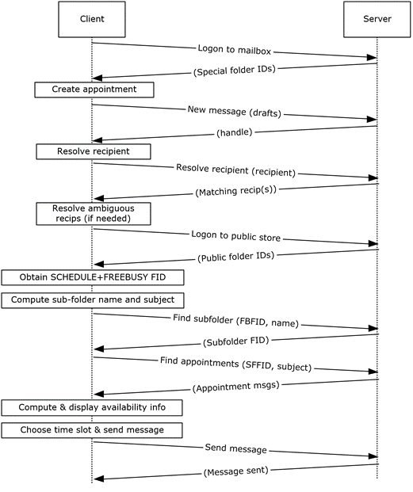

<html dir="LTR" xmlns:mshelp="http://msdn.microsoft.com/mshelp" xmlns:ddue="http://ddue.schemas.microsoft.com/authoring/2003/5" xmlns:xlink="http://www.w3.org/1999/xlink" xmlns:tool="http://www.microsoft.com/tooltip">
    <head>
        <meta http-equiv="Content-Type" content="text/html; CHARSET=utf-8"></meta>
        <meta name="save" content="history"></meta>
        <title>3.4.5 Details</title>
        <xml>
            <mshelp:toctitle title="3.4.5 Details"></mshelp:toctitle>
            <mshelp:rltitle title="[MS-OXPROTO]: Details"></mshelp:rltitle>
            <mshelp:keyword index="A" term="f1c4f723-f823-48db-8a6b-a998c3a2eae9"></mshelp:keyword>
            <mshelp:attr name="DCSext.ContentType" value="open specification"></mshelp:attr>
            <mshelp:attr name="AssetID" value="f1c4f723-f823-48db-8a6b-a998c3a2eae9"></mshelp:attr>
            <mshelp:attr name="TopicType" value="kbRef"></mshelp:attr>
            <mshelp:attr name="DCSext.Title" value="[MS-OXPROTO]: Details" />
        </xml>
    </head>
    <body>
        

            <h1 class="heading">3.4.5 Details</h1>
        

        

            

                

                

                    

<b>Figure 42: Creating an appointment using free-busy data </b>

<ol><li>
    The client logs
on to the <a href="f888c37a-d994-4b91-96a5-e88cfbd66bd6.htm#gt_d3ad0e15-adc9-4174-bacf-d929b57278b3">mailbox</a> per
the use case described in section <a href="073b1877-3b61-4cbe-bd4e-8e158a1a8795.htm">2.5.2</a>.

</li><li>
    An end user
creates a new appointment.

</li><li>
    The client
creates a new message in the drafts folder per the use case described in
section <a href="9f011f97-a468-422c-a65d-0df484b07106.htm">2.5.3</a>. The
Exchange server returns a handle to the new message.

</li><li>
    The end user
enters the name of the invitee and chooses to resolve the recipient.

</li><li>
    The client
resolves the recipient per the use case described in section <a href="4d562c60-77cc-4261-b858-d3e5b08eef0f.htm">2.5.6</a>. The server returns
the successful matches (or none if there are no matches).

</li><li>
    If the Exchange
server returns more than a single match, the end user is presented with a list
of matches and is asked to select the correct recipient from the list.

</li><li>
    The client logs
on to the public <a href="f888c37a-d994-4b91-96a5-e88cfbd66bd6.htm#gt_fda94a53-448d-48d5-9991-176c530ff597">message
store</a>, as described in <mshelp:link keywords="d42ed1e0-3e77-4264-bd59-7afc583510e2" tabindex="0">[MS-OXCSTOR]</mshelp:link>
(using steps similar to the use case described in section 2.5.2).

</li><li>
    The Exchange
server returns a list of IDs for special folders upon successful logon. The
client obtains the FID of the &quot;SCHEDULE+FREEBUSY&quot; folder, as
described in <mshelp:link keywords="1a527299-7211-4d27-a74c-b69bd0746320" tabindex="0">[MS-OXOPFFB]</mshelp:link>,
from the list of special FIDs.

</li><li>
    Based on the <a href="f888c37a-d994-4b91-96a5-e88cfbd66bd6.htm#gt_d16f7b78-c5a6-48f4-9e0f-3b205b5598b5">address book</a> information of
the resolved invitee, the client computes the name of the subfolder that
contains the invitee's free-busy information and the subject for the
appointment message, as described in [MS-OXOPFFB].

</li><li>
  The client performs a folder
search in the &quot;SCHEDULE+FREEBUSY&quot; <a href="f888c37a-d994-4b91-96a5-e88cfbd66bd6.htm#gt_94523846-05ff-4a8b-bb73-7b3e5fec19aa">public folder</a> to find the
FID of the subfolder that matches the computed subfolder name per the use case
described in section <a href="c17348f9-48a3-48ca-a6d7-783f26af9159.htm">2.5.9</a>.

</li><li>
  The client performs another
folder search in the subfolder to find all appointment messages whose subject
(the <b>PidTagSubject</b> property, as described in <mshelp:link keywords="f6ab1613-aefe-447d-a49c-18217230b148" tabindex="0">[MS-OXPROPS]</mshelp:link>
section <mshelp:link keywords="d320815d-dbd6-4962-8462-e270afa081fd" tabindex="0">2.1034</mshelp:link>)
matches the computed subject in step 9 per the use case described in section
2.5.9.

</li><li>
  The client scans the
appointment messages to calculate the invitee's availability and presents the
availability to the end user.

</li><li>
  The end user chooses a time
slot based on the free-busy information.

</li><li>
  The end-user enters some
message text and sends the invite.

</li><li>
  The client submits the
message per the use case described in section <a href="f9893689-a4aa-423c-82a4-4c714bf90b31.htm">2.5.7</a>.

</li></ol>
                

            

        

    </body>
</html>